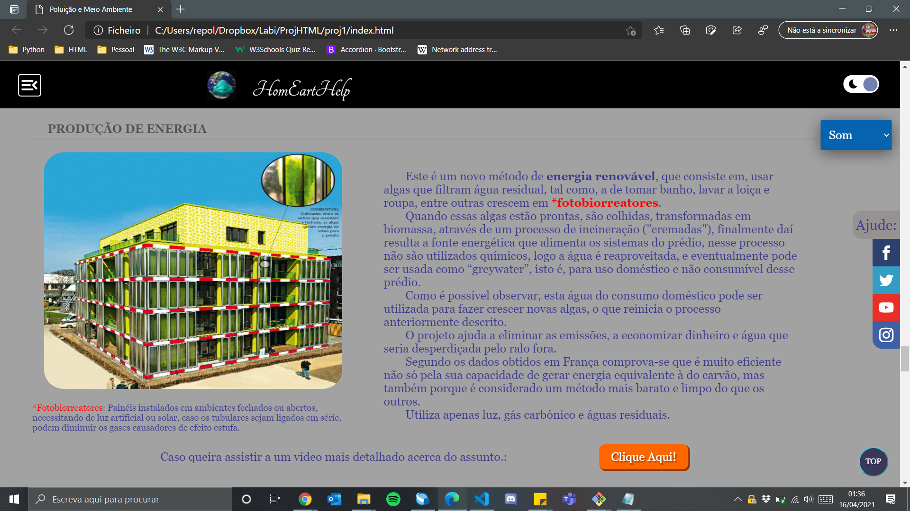
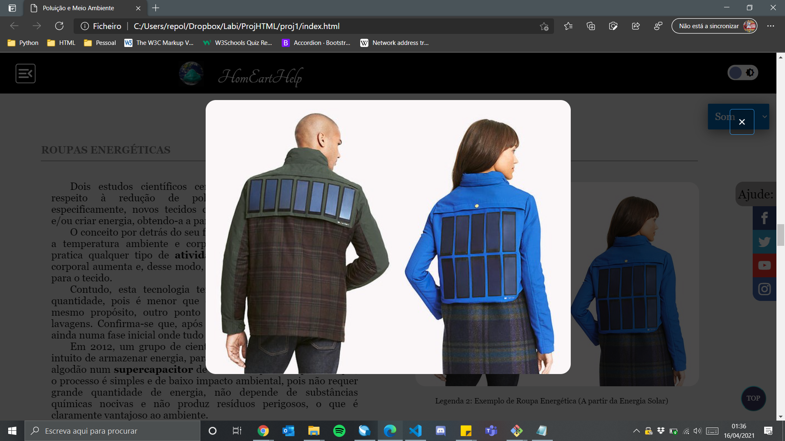
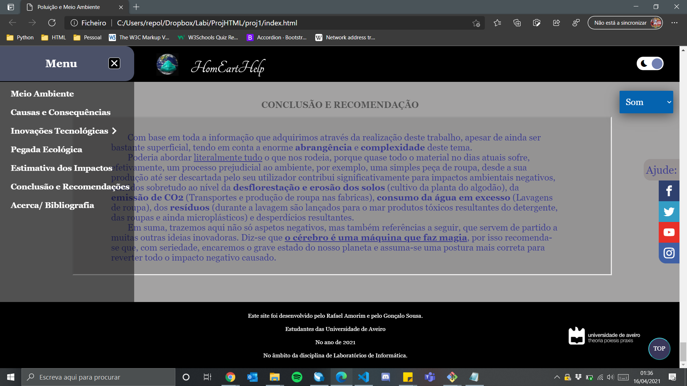
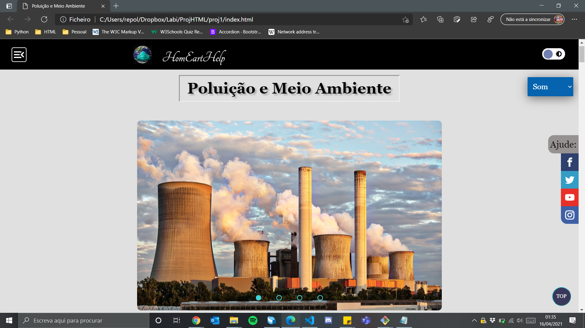
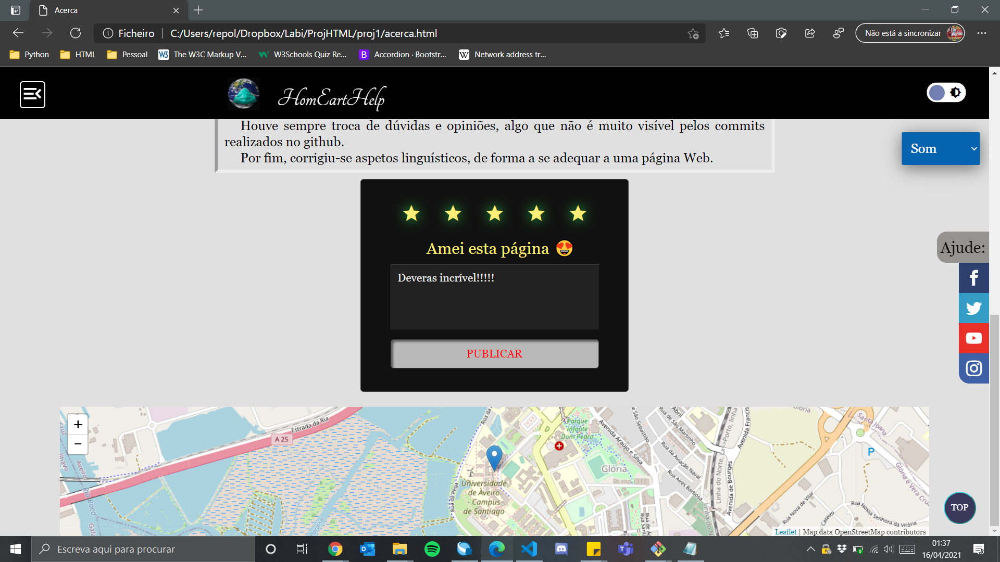
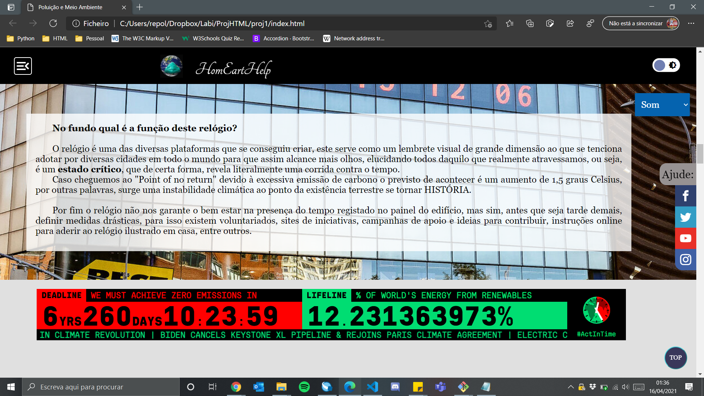

# MeioAmbiente_HTML
Este projeto desenvolveu-se no âmbito da disciplina de Laboratório de Informática

- Após algumas pesquisas, reuni toda a informação sobre "Como ajudar o Meio Ambiente" e com o propósito de massacrar o menos possível aos leitor, misturei um pouco de interatividade.

     

Não foi utilizado templates para este trabalho, aliás isso é possivel ver através do código.
Poderia ser um site a saltar entre páginas, no entanto, preferiu-se o modo como está apresentado!
