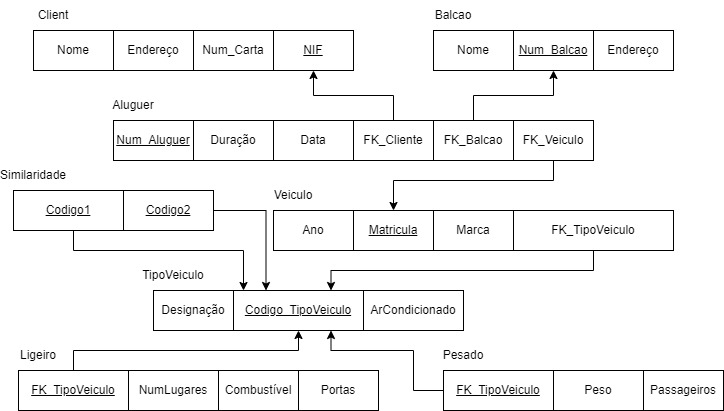
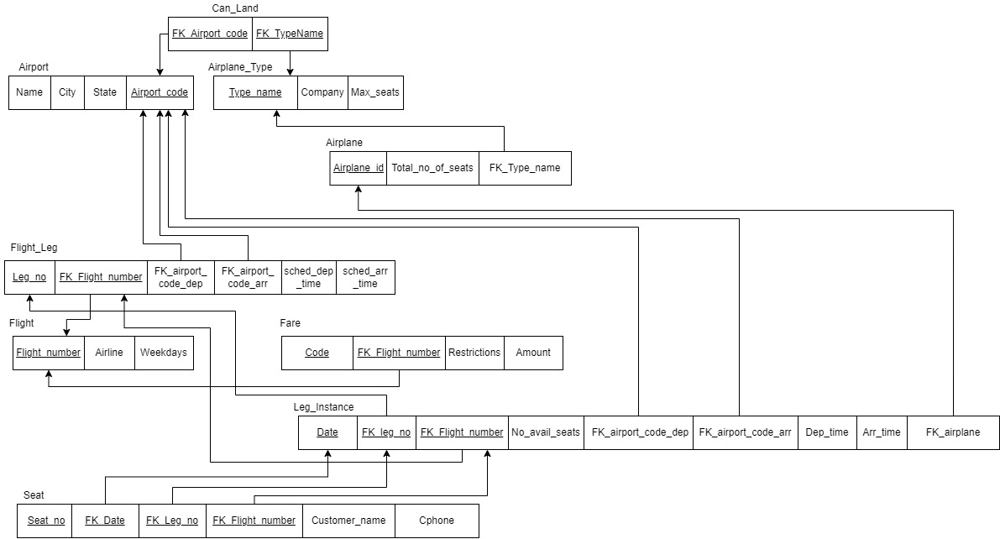
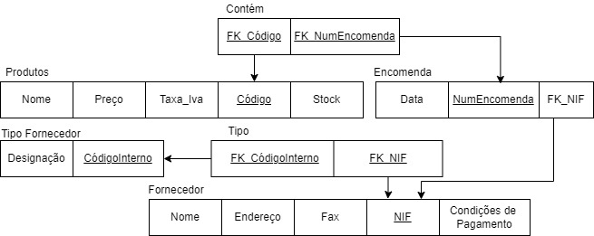
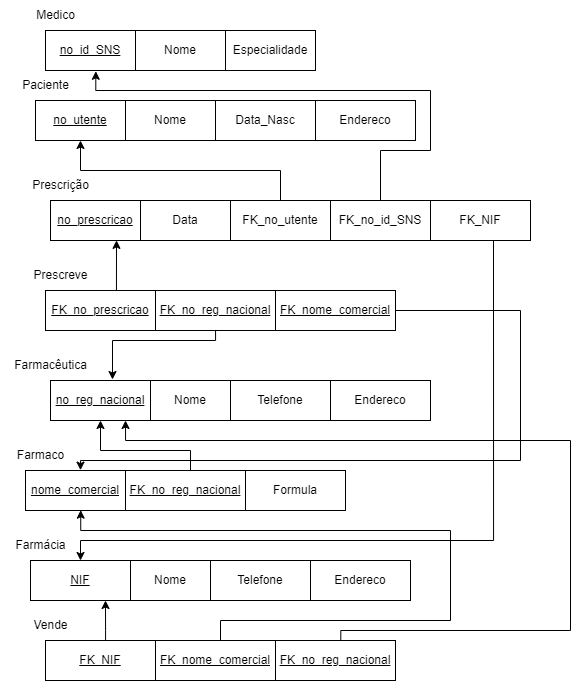
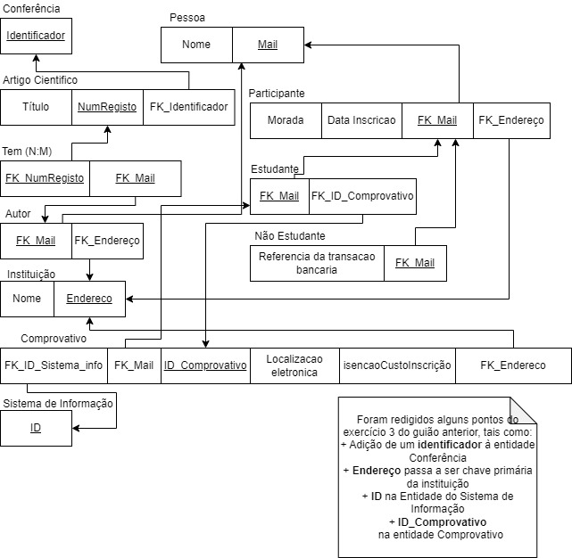
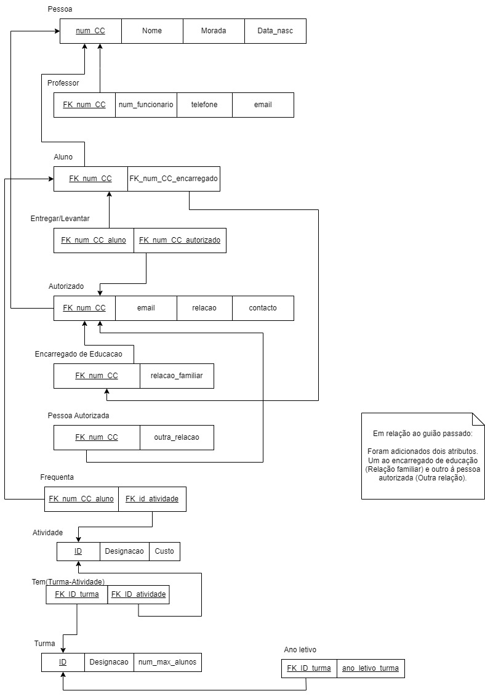

# BD: Guião 3


## ​Problema 3.1
 
### *a)*

```
CLIENTE(nome, endereco, num_carta, NIF)
ALUGUER(número, duracao, data)
BALCAO(nome, endereco, número)
VEICULO(matricula, marca, ano)
TIPO_VEICULO(designacao, arcondicionado, codigo)
LIGEIRO(numlugares, portas, combustivel)
PESADO(peso, passageiros)
```


### *b)* 


| - | Cliente   | Aluguer | Balcão | Veículo | TipoVeiculo | Pesado | Ligeiro |                                           
| - | - | - | - | - | - | - | - |   
| Candidatas     | NumCarta, NIF | Nº | Nº | Matrícula | Código | Código | Código |
| Primarias     | Nº | Nº | Matrícula | Código | Código | Código | Código |
| Estrangeiras  | - | Titular, Local, Objeto | - | CodigoTipoVeiculo | - | Código | Código | 


### *c)* 




## ​Problema 3.2

### *a)*

```
AIRPORT(airport_code, city, state, name)
AIRPLANE_TYPE(type_name, company, max_seats)
CAN_LAND(airport_code, type_name)
AIRPLANE(airplane_id, total_no_of_seats)
FLIGHT_LEG(leg_no, flight_number, airport_code_arr, airport_code_dep, sched_dep_time, sched_arr_time) 
FLIGHT(number, airline, weekdays)
FARE(code, flight_number, amount, restrictions)
LEG_INSTANCE(date, leg_no, flight_number, airplane_id, dep_time, arr_time, airport_code_arr, airport_code_dep)
SEAT(seat_no, customer_name, cphone, date, leg_no, flight_number)
```


### *b)* 
| - | Airport   | Airplane Type | Can Land | Airplane | Flight Leg | Flight | Fare | Leg Instance | Seat |
| - | - | - | - | - | - | - | - | - | - |
| Candidatas     | airport_code, city | type_name | airport_code, type_name  | airplane_id | leg_no, flight_number | flight_number | code, flight_number | date, leg_no, flight_number | seat_no, date, leg_no, flight_number | 
| Primarias     | airport_code | type_name | airport_code, type_name | airplane_id | leg_no, flight_number | flight_number | code, flight_number | date, leg_no, flight_number | seat_no, date, leg_no, flight_number |
| Estrangeiras  | - | - | airport_code, type_name | type_name | flight_number, airport_code_dep, airport_code_arr | - | flight_number | leg_no, flight_number, airplane_id, airport_code_dep, airport_code_arr | date, leg_no, flight_number |


### *c)* 




## ​Problema 3.3


### *a)* 2.1



### *b)* 2.2



### *c)* 2.3



### *d)* 2.4

