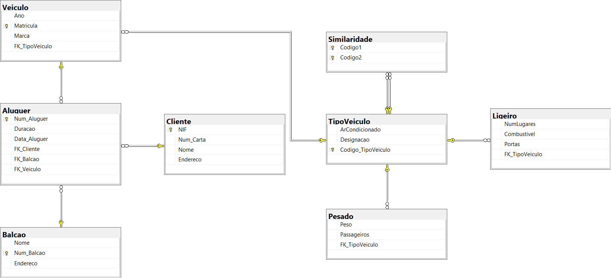
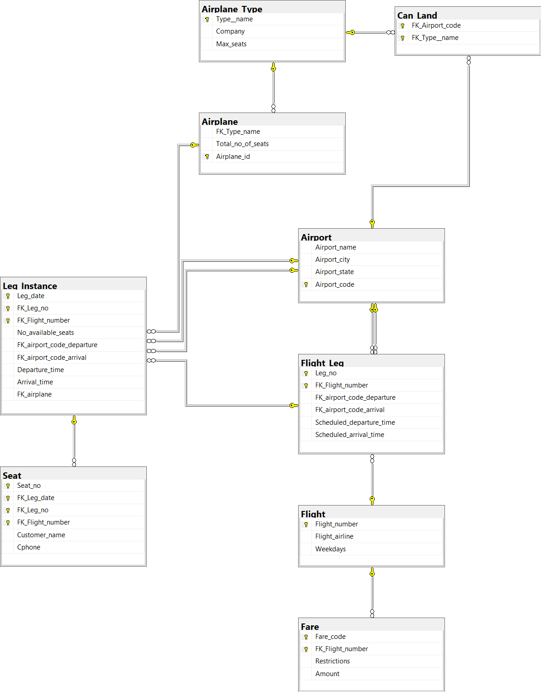
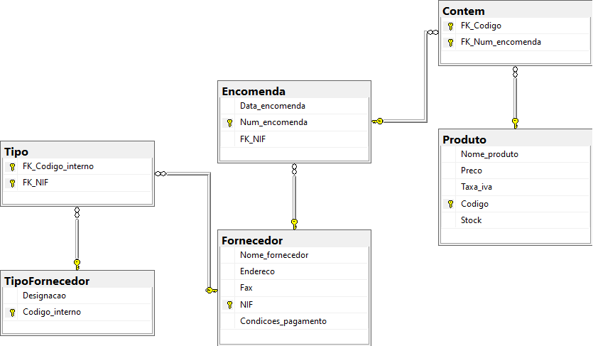
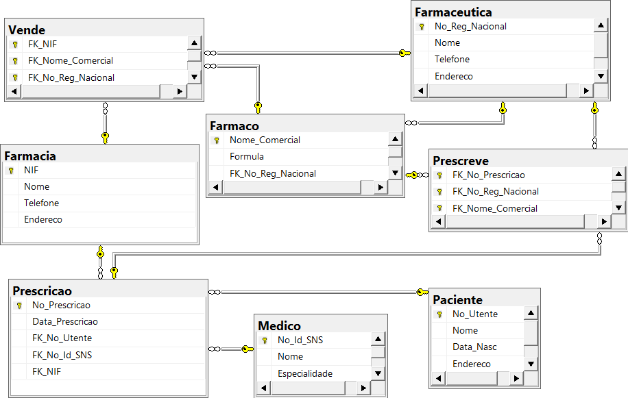
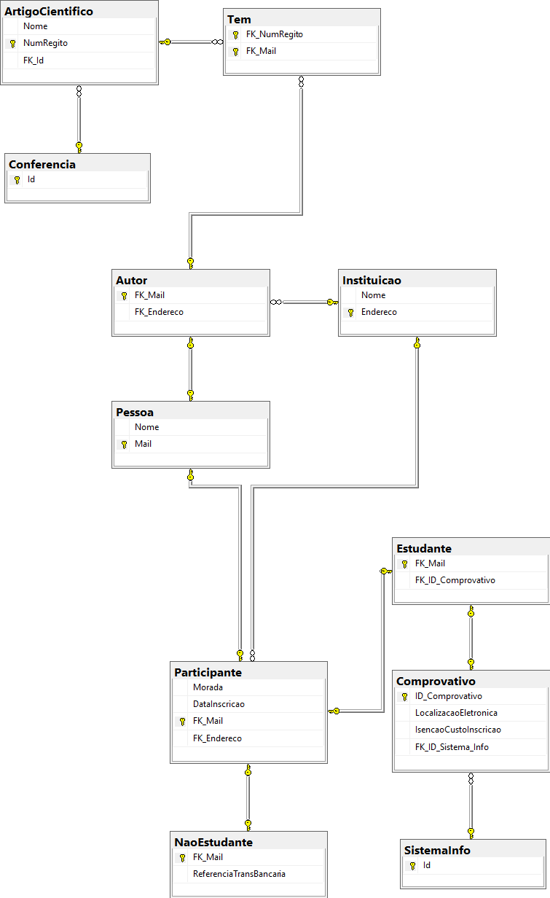
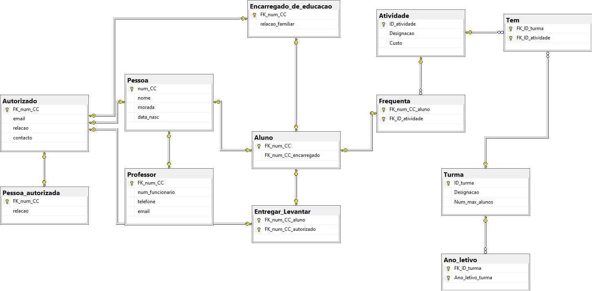

# BD: Guião 4

Erros corrigidos dos guiões anteriores:

Exercicio 1:
> Seta ao contrario FK Tipo Veiculo aponta para Tipo Veiculo
> Atributo no TipoVeiculo não é Marca, é ArCondicionado
> Retiramos o atributo Similaridade do TipoVeiculo tinhamos por engano

Exercicio 2: 
> Entidades fracas nem sempre vão buscar os atributos da entidade forte diretamente, como tinhamos feito nas ligações do modelo relacional do guião anterior. Para a Leg_instance, por exemplo, vamos buscar as PKs da seguinte entidade a que esta está diretamente associada (Flight_Leg). Flight_leg também é uma entidade fraca, mas esta vai buscar a PK da entidade forte, Flight.   

Exercicio 4:
> Prescrição vai buscar NIF à farmácia e não à Farmaceutica

Exercicio 5:
> Falta a ponta da seta a apontar do Estudante para o Comprovativo no ID_Comprovativo
> Falta o comprovativo ir buscar o endereço à instituição pq N:1
> Relação 1:1 escolhemos o comprovativo no estudante

## ​Problema 4.1

### 1. Sistema de Gestão de um Rent-a-Car

[SQL DDL File](ex_4_1_1.sql "SQLFileQuestion")

### 2. Sistema de Gestão de Reservas de Voos

[SQL DDL File](ex_4_1_2.sql "SQLFileQuestion")

### 3. Sistema de Gestão de Stocks – Módulo de Encomendas

[SQL DDL File](ex_4_1_3.sql "SQLFileQuestion")

### 4. Sistema de Prescrição Eletrónica de Medicamentos 

[SQL DDL File](ex_4_1_4.sql "SQLFileQuestion")

### 5. Sistema de Gestão de Conferências

[SQL DDL File](ex_4_1_5.sql "SQLFileQuestion")

### 6. Sistema de Gestão de ATL

[SQL DDL File](ex_4_1_6.sql "SQLFileQuestion")

