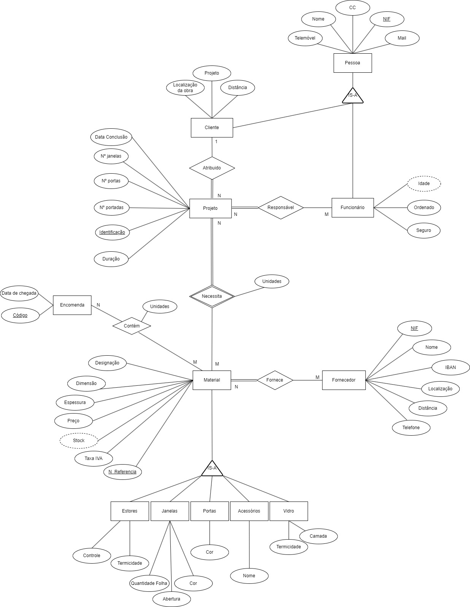
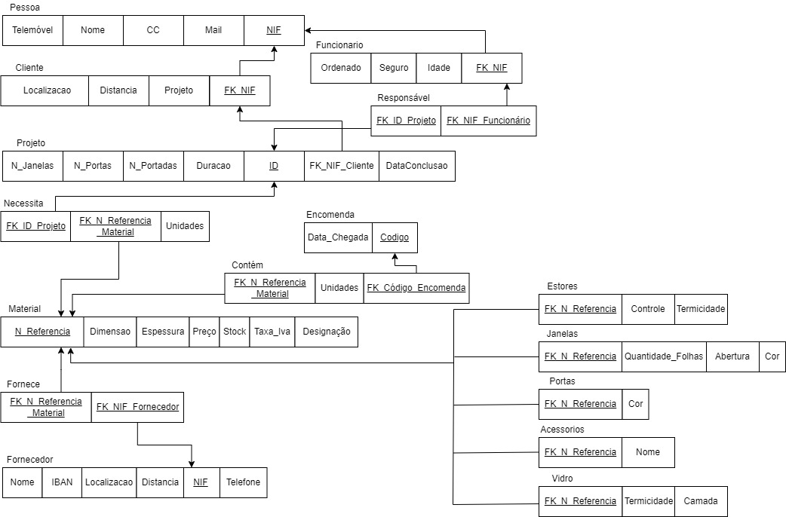
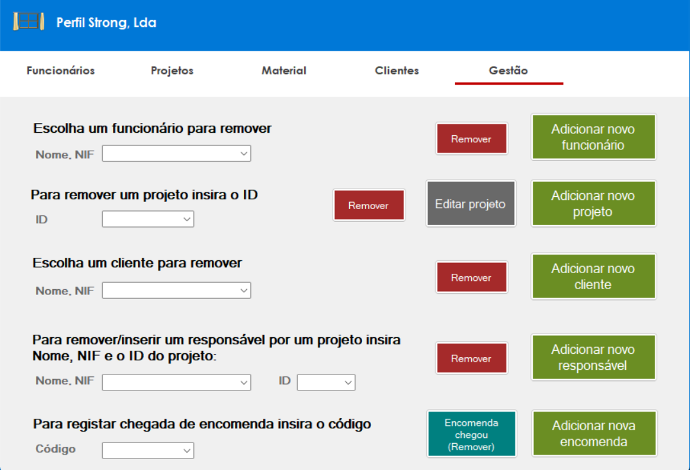
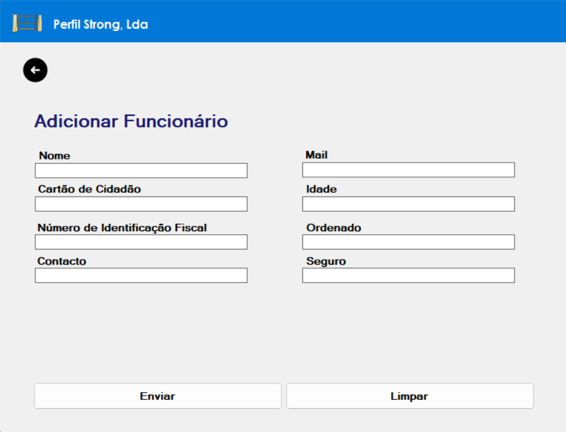
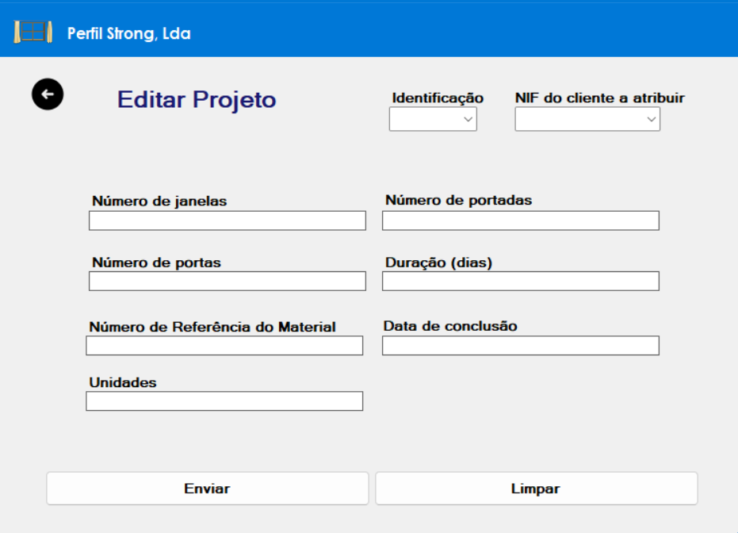

# BD: Trabalho Prático APF-T

**Grupo**: P7G5
- Rafael Amorim, MEC: 98197
- Tiago Alves, MEC: 104110

---

## Introdução
 
O projeto da base de dados para gestão da empresa Perfil-Strong, Lda foi realizado no âmbito da unidade curricular de Base de Dados, da Licenciatura em Engenharia de Computadores e Informática da Universidade de Aveiro. A ideia deste projeto seria a criação de uma base de dados com ligação a uma interface que permitisse fazer a gestão de um sistema funcional e com complexidade razoável e aplicável ao mundo profissional.

A empresa Perfil-Strong, Lda pertence ao pai de um dos alunos, sendo esta uma empresa focada no fabrico de caixilharia como, por exemplo, portas, portadas, janelas, portões entre outros que envolvem alumínios. 
Este realiza também montagem de obras na casa dos clientes.


## ​Análise de Requisitos

Com o objetivo do projeto se aproximar o máximo possível da realidade e de definir melhor os requisitos, foram realizadas várias conversas com o dono da empresa, a fim de esclarecer dúvidas sobre o funcionamento de todo o processo logístico para gerir a empresa.</br>

Os requisitos definidos foram os seguintes:

- Inserir/remover clientes.
- Inserir/remover funcionários.
- Inserir/remover projetos associados a um cliente.
- Adicionar/remover funcionários responsáveis por projetos.
- Editar características de um projeto e respetivos materiais.
- Obter uma estimativa de orçamento para um projeto tendo em conta transportes realizados, mão de obra e preço do material.
- Consultar informação de projetos a serem realizados.
- Consultar informação de clientes.
- Consultar informação de funcionários.
- Consultar se os funcionários estão ocupados (responsáveis por projetos) ou livres.
- Inserir novas encomendas de material.
- Registar chegada de encomendas.
- Incrementar stock com chegada de encomendas e decrementar ao eliminar projeto (projeto acabado).
- Consultar material:
  -	Necessário para um projeto;
  -	Abaixo de um preço limite;
- Consultar informação de fornecedores.

## DER - Diagrama Entidade Relacionamento

Durante a realização do projeto foram reconhecidas algumas mudanças necessárias em relação ao DER inicial.

### Versão final



### APFE 

As mudanças realizadas em relação ao DER inicial são as seguintes:
-	Foi retirada a relação Realizada entre as entidades Projeto e Encomenda. As encomendas deixam assim de estar associadas a projetos e são realizadas regularmente.
-	O Projeto deixa de ser entidade fraca, e assim a sua chave primária passa a ser apenas a sua Identificação.
-	Foram criadas cinco novas entidades, Estores, Janelas, Portas, Acessórios e Vidros de forma a melhor específicicar os atributos para diferentes materiais.
-	A relação Responsável passou a ser de N:M e a relação Envolve entre as entidades Projeto e Funcionário foi eliminada, evitando a redundância.
-	A chave primária de uma pessoa passou a ser o NIF.
-	Acrescentado o atributo "Telefone" à entidade Fornecedor, atributo "Projeto" a Cliente e atributo "Camada" a Vidro.
-   Foi criado o atributo "Data de Conclusão" adicionado ao Projeto já que este é diferente da Duração, isto é, se a duração do projeto for 5 dias mas ainda faltar um mês para a data de conclusão definida o projeto não tem de ser começado de imediato.
-   Número de Referência passou a ser chave primária e atributo Nome foi substítuido por Designação na entidade Material.

## ER - Esquema Relacional

### Versão final



### APFE

Tendo em conta o DER final as principais mudanças realizadas no ER relativamente à primeira entrega foram:
-   Nova tabela para a relação Responsável.
-   Como Projeto deixou de ser entidade fraca este já não tem NIF do cliente como parte da sua chave primária (Retirada também das restantes tabelas que têm referência ao projeto).
-   Encomenda deixou de ter chave estrangeira do projeto.
-   Sub-entidades Estores, Janelas, Portas, Acessorios e Vidro acrescentadas com atributo Nº Referência da super-entidade Material como chave estrangeira e primária destas.

## ​SQL DDL - Data Definition Language

[SQL DDL File](sql/01_ddl.sql "SQLFileQuestion")
<br>Com base no ER foram criadas 16 tabelas com as restrições apropriadas para as chaves estrangeiras. Além disso, foram adicionados diversos checks, como por exemplo, para garantir que os NIFs são compostos por 9 dígitos.<br><br>

## SQL DML - Data Manipulation Language

A seguir apresentamos alguns exemplos que demonstram SQL DML no nosso projeto, tendo em conta a interface e o código associado.


### __Eliminação de dados__

### Formulário para Remoção



Na página da gestão, a maioria das operações é de DELETE sendo que para tal basta inserir o NIF para remover Funcionário, Cliente ou Responsáveis, ID para Projeto ou Responsáveis e Código para remover a Encomenda. Toda a informação relacionada com a informação apagada desaparece da base de dados, sendo que este encadeamento de remoções é resolvido com o auxílio de triggers.

Os dois códigos abaixo representam o funcionamento dos deletes para uma remoção no cliente. Os restantes botões de remoção têm a mesma lógica. O primeiro excerto foi utilizado na interface e o segundo no ficheiro de triggers.

```cs
string deleteClienteQuery = "DELETE FROM cliente WHERE FK_NIF = @NIF";
```

```sql
CREATE TRIGGER trg_delete_client ON cliente INSTEAD OF DELETE
AS 
BEGIN
    -- Delete from the 'responsavel' table
    DELETE FROM responsavel
    WHERE FK_ID_Projeto IN (SELECT ID FROM projeto WHERE FK_NIF_Cliente IN (SELECT FK_NIF FROM deleted));

    -- Delete from the 'necessita' table
    DELETE FROM necessita
    WHERE FK_ID_Projeto IN (SELECT ID FROM projeto WHERE FK_NIF_Cliente IN (SELECT FK_NIF FROM deleted));

    -- Delete from the 'projeto' table
    DELETE FROM projeto
    WHERE FK_NIF_Cliente IN (SELECT FK_NIF FROM deleted);

    -- Delete from the 'cliente' table
    DELETE FROM cliente
    WHERE FK_NIF IN (SELECT FK_NIF FROM deleted);

    -- Delete from the 'pessoa' table
    DELETE FROM pessoa
    WHERE NIF IN (SELECT FK_NIF FROM deleted);
END;
```


<br>

### __Inserção de dados__

### Formulário Adicionar Funcionário



Criaram-se várias páginas com o formato de fichas de inscrição onde cada uma era adaptada para a sua "tabela", ou seja, para o cliente, o funcionário, o projeto e a encomenda. 

Nestas tabelas ao inserir as suas características na base de dados tem que se ter em consideração as respetivas restrições indicadas pelos checks na sua criação e também as regras definidas nos triggers como por exemplo, o funcionário não pode estar responsável por mais de 2 projetos, um funcionário não pode ser um cliente (NIFs têm de ser diferentes), entre outros.

Os códigos a seguir mostram como foram utilizadas as queries na interface e os stored procedures, triggers a considerar para essa inserção ser bem sucedida.

```cs
SqlCommand command = new SqlCommand("sp_add_funcionario", cn);
```
```sql
create proc sp_add_funcionario	@Mail varchar(50), @CC char(8), @Nome varchar(20), @Telemovel char(9), @NIF char(9), @Idade int, @Ordenado real, @Seguro char(3)
as
	begin
		insert into pessoa(Mail, CC, Nome, Telemovel, NIF) 
		values (@Mail, @CC, @Nome, @Telemovel, @NIF);
		insert into funcionario(Ordenado, Seguro, Idade, FK_NIF)
		values (@Ordenado,@Seguro,@Idade,@NIF);
	end
```
```sql
CREATE TRIGGER VerificarNIFs_Funcionario ON funcionario AFTER INSERT 
AS 
BEGIN
    -- Check if the NIF of the inserted employee matches any client's NIF
    IF EXISTS (
        SELECT 1
        FROM inserted i
        JOIN cliente c ON i.FK_NIF = c.FK_NIF
    )
    BEGIN
        RAISERROR('O NIF do funcionário deve ser diferente do NIF do cliente.', 16, 1);
        ROLLBACK TRANSACTION;
        DELETE f
        FROM funcionario f
        INNER JOIN inserted i ON f.FK_NIF = i.FK_NIF;
    END;
END;
```


### __Alteração de dados__

### Formulario Editar Projeto



O processo para editar um projeto baseia-se na alteração de um ou mais atributos da entidade projeto. Para que tal funcionasse criou-se uma stored procedure onde foi necessário colocar todos os atributos por default a null exceto o do ID. Desta forma obriga o Sr. Amorim a inserir o ID do projeto que pretende modificar. Existe a possibilidade ainda de alterar o material e as respetivas unidades do projeto associado. 

```cs
string query = "sp_update_projeto";
```
```sql
CREATE PROCEDURE sp_update_projeto
    @id INT,
    @nJanelas INT = NULL,
    @nPortas INT = NULL,
    @nPortadas INT = NULL,
    @duracao INT = NULL,
    @dataConclusao DATE = NULL,
    @material VARCHAR(50) = NULL,
    @unidades INT = NULL,
    @nifCliente INT = NULL
AS
BEGIN
    BEGIN TRY
        BEGIN TRANSACTION;
        
        DECLARE @old_id AS INT;
        DECLARE @old_nJanelas AS INT;
        DECLARE @old_nPortas AS INT;
        DECLARE @old_nPortadas AS INT;
        DECLARE @old_duracao AS INT;
        DECLARE @old_dataConclusao AS DATE;

        SELECT @old_id = ID, @old_nJanelas = N_Janelas, @old_nPortas = N_Portas, @old_nPortadas = N_Portadas, @old_duracao = Duracao, @old_dataConclusao = Data_conclusao
        FROM projeto
        WHERE projeto.ID = @id;

        IF @old_id IS NOT NULL
        BEGIN
            IF (@nJanelas IS NOT NULL AND @old_nJanelas != @nJanelas)
            BEGIN
                UPDATE projeto SET N_Janelas = @nJanelas WHERE ID = @old_id;
                PRINT 'Número de janelas do projeto atualizado com sucesso.';
            END

            IF (@nPortas IS NOT NULL AND @old_nPortas != @nPortas)
            BEGIN
                UPDATE projeto SET N_Portas = @nPortas WHERE ID = @old_id;
                PRINT 'Número de portas do projeto atualizado com sucesso.';
            END

            IF (@nPortadas IS NOT NULL AND @old_nPortadas != @nPortadas)
            BEGIN
                UPDATE projeto SET N_Portadas = @nPortadas WHERE ID = @old_id;
                PRINT 'Número de portadas do projeto atualizado com sucesso.';
            END

            IF (@duracao IS NOT NULL AND @old_duracao != @duracao)
            BEGIN
                UPDATE projeto SET Duracao = @duracao WHERE ID = @old_id;
                PRINT 'Duração do projeto atualizada com sucesso.';
            END

            IF (@dataConclusao IS NOT NULL AND @old_dataConclusao != @dataConclusao)
            BEGIN
                UPDATE projeto SET Data_conclusao = @dataConclusao WHERE ID = @old_id;
                PRINT 'Data de conclusão do projeto atualizada com sucesso.';
            END

            IF (@nifCliente IS NOT NULL)
            BEGIN
                IF EXISTS (SELECT 1 FROM cliente WHERE FK_NIF = @nifCliente)
                BEGIN
                    UPDATE projeto SET FK_NIF_Cliente = @nifCliente WHERE ID = @old_id;
                    PRINT 'Projeto atribuído ao cliente atualizado com sucesso.';
                END
                ELSE
                BEGIN
                    PRINT 'O NIF fornecido não corresponde a nenhum cliente existente.';
                END
            END

            IF (@material IS NOT NULL AND @unidades IS NOT NULL)
            BEGIN
                IF EXISTS (SELECT 1 FROM necessita WHERE FK_ID_Projeto = @old_id AND FK_N_Referencia_Material = @material)
                BEGIN
                    UPDATE necessita SET Unidades = @unidades WHERE FK_ID_Projeto = @old_id AND FK_N_Referencia_Material = @material;
                    PRINT 'Unidades atualizadas com sucesso.';
                END
                ELSE
                BEGIN
                    INSERT INTO necessita (FK_N_Referencia_Material, Unidades, FK_ID_Projeto) VALUES (@material, @unidades, @old_id);
                    PRINT 'Material inserido com sucesso.';
                END
            END

            IF (@nJanelas IS NULL AND @nPortas IS NULL AND @nPortadas IS NULL AND @duracao IS NULL AND @dataConclusao IS NULL AND @material IS NULL AND @unidades IS NULL AND @nifCliente IS NULL)
            BEGIN
                PRINT 'Nenhum campo foi fornecido para atualização.';
            END
        END
        ELSE
        BEGIN
            PRINT 'O ID fornecido não corresponde a nenhum projeto existente.';
        END

        COMMIT;
    END TRY
    BEGIN CATCH
        PRINT ERROR_MESSAGE();
        ROLLBACK;
    END CATCH
END
```

## Normalização/Normalization

A normalização é um processo utilizado para minimizar a duplicação de dados e reduzir o espaço ocupado por uma estrutura de banco de dados.

Apresentamos um exemplo onde é visível esse cuidado:

- 1NF: A tabela pessoa tem todos os atributos atómicos.

- 2NF: Todos os atributos do cliente dependem totalmente da chave primária FK_NIF.

- 3NF: Não existem dependencias transitivas entre atributos não chave.

As restantes relações encontram-se também na terceira forma normal.

## Índices
[SQL Indexes File](sql/05_idx.sql "SQLFileQuestion")

Os índices foram feitos tendo em consideração os atributos mais pesquisados, para que fosse possível melhorar o desempenho das consultas pelas tabelas e agilizar a recuperação de dados. Portanto como o Sr.Amorim faz uma grande procura de materiais por preço e por designação considerámos fundamental criar um índice clustered para esta combinação. Seguindo a mesma lógica, criámos um índice para o nome permitindo a procura de projetos pelo nome do cliente na barra de pesquisa.

Além disso, a maioria das queries utilizam apenas as chaves primárias, portanto, não são necessários índices adicionais.

```sql
CREATE INDEX index_preco_designacao ON material(preco, designacao);
CREATE INDEX index_nome ON pessoa(nome);
```

### Stored Procedures
[SQL SPs File](sql/02_sp.sql "SQLFileQuestion")

As Stored Procedures permitem criar uma camada de abstração sobre a base de dados, tornando não só a sua utilização na interface mais simples como também diminuindo o risco de comprometer a integridade do conteúdo da base de dados.<br><br> 
Criámos assim três Stored Procedures evitando que a alteração de dados na base de dados não fosse executada diretamente sobre a mesma: 
- Adicionar cliente
    - Como um cliente é uma pessoa (relação IS-A) a SP cria primeiro a pessoa e depois o cliente.
- Adicionar funcionário
    - Funcionário também é uma pessoa, portanto esta SP faz o mesmo que a de cima.
- Alterar projeto
    - Permite atualizar os vários campos de um projeto, tal como o material e unidades do mesmo.
<br><br>

### UDF
[SQL Functions File](sql/03_functions.sql "SQLFileQuestion")

As User-Defined Functions na nossa aplicação são úteis para reutilizar código, permitindo o uso do resultado de uma função dentro de outra e facilitando a compreensão. As UDFs também ajudam a criar uma camada de abstração.

- SalarioSuperior
    - Ao inserir um valor que representa o ordenado do funcionário, é devolvido todos aqueles que possuem ordenado acima deste. Esta função serve para caso do Sr. Amorim querer consultar os ordenados e assim indicar alguma tarefa de igual importância.
- ListarMateriaisPorPreco
    - Ao escolher por uma designação de material e indicado um preço máximo para esta, a função devolve todos os materiais abaixo do preço indicado.  
- ListarMateriaisProjeto
    - Ao pesquisar pelo ID do projeto, esta função retorna todos os materiais necessários para o mesmo. Assim, é possível ver se há  materiais em falta para o projeto
- ObterDetalhesFornecedoresPorProjeto
    - Para saber o estado das encomendas de um projeto o Sr. Amorim  pode consultar pelo ID do projeto e assim consegue contactar os fornecedores envolvidos. 
- Dist_Total
    - Após as escolhas do cliente em relação aos materiais e respetivos fornecedores, é calculada a distância de ida e volta desde a fabrica até à localidade do cliente somando com os custos de deslocação à localização dos fornecedores. 
- ListarClientePorProjeto
    - Para relembrar a localização, o contacto, entre outros, de um cliente o Sr. Amorim pode consultar apenas pelo ID do projeto e a partir daí consegue obter toda a informação que precisa do cliente.
- CalcularOrcamento
    - Esta função reutiliza outras duas, nomeadamente a da Dist_Total  e a de ListarMateriaisProjeto, assim diminui a complexidade.
    - A lógica por de trás desta função é contabilizar o total que um cliente precisa de pagar pelo projeto, sendo o raciocínio a soma dos transportes, mão de obra (duracao * numero de funcionários responsáveis pelo projeto) e preço do material.
<br><br>

## Views 

[SQL Views File](sql/04_views.sql "SQLFileQuestion")

Aproveitamos o uso das Views, uma vez que são representações virtuais de dados que proporcionam uma forma organizada e simplificada de visualizar informações a partir de consultas complexas. Implementamos quatro consultas semelhantes para disponibilizar informações sobre funcionários e clientes, distinguindo entre aqueles que têm ou não projetos.

## Triggers 

[SQL Triggers File](sql/06_triggers.sql "SQLFileQuestion")

Decidimos criar os seguintes triggers para o nosso projeto:
- Apagar projeto 1 (instead of delete)
    - Quando um projeto acaba (e é removido), o stock é decrementado, retirando o material usado nesse projeto; As referências ao projeto nas outras tabelas são apagadas antes do próprio projeto.
- Apagar projeto 2 (after delete) 
    - Atualiza o atributo ‘Projeto’ do cliente se este não tiver mais projetos associados.
- Remover funcionário (instead of delete)
    - Apagar referências na tabela responsável, depois apagar o funcionário e finalmente apagar o mesmo da tabela pessoa (super-entidade). 
- Remover cliente (instead of delete)
    - Primeiro são removidos os projetos que estavam associados ao cliente, depois o cliente é removido e finalmente é também retirado da tabela pessoa. 
- Inserir projeto (after insert)
    - Atualiza o atributo ‘Projeto’ do cliente se este ainda não tinha projetos associados.
- Chegada de encomenda (instead of delete)
    - Incrementa stock e remove a encomenda.
- Responsável por projeto (after insert)
    - A transação só é encerrada caso o funcionário não fique a trabalhar em mais de 2 projetos, ou seja o limite de projetos por funcionário é de 2. 
- Data de conclusão do projeto (after update, insert)
    - A duração, em dias, até à data de conclusão do projeto não pode ser menor que a duração inserida.
- Remover fornecedor (instead of delete)
    - Primeiro apaga as referências na tabela fornece e depois apaga o fornecedor.
- Verificar NIFs de clientes (after insert)
    - Um funcionário não pode ser um cliente.
- Verificar NIFs de funcionários (after insert)
    - Um cliente não pode ser um funcionário.
<br><br>

## Conclusão
Concluindo, este projeto fez-nos trabalhar de forma a aplicar os conceitos das aulas para criar uma aplicação útil e consistente onde as principais funcionalidades previstas foram implementadas.<br><br>
O Sr. Amorim pode consultar dados de funcionários, clientes, projetos, encomendas, materiais e fornecedores, essenciais para a gestão da sua empresa. Além da consulta pode também adicionar ou remover clientes, funcionários, definir quem está responsável por que projetos e registar a chegada ou registar o pedido de encomendas.<br><br>
Pode ainda adicionar novos projetos, alterar as suas características, e com a reunião dos dados é lhe feita uma estimativa do orçamento do projeto.<br><br>