# Development of a WebApp

## Backend Development

At the beginning of the project, I initiated the development of a local database in PostgreSQL. This database was designed to store user data (User table), existing caches (Box table), and completed discoveries (Discovery table).

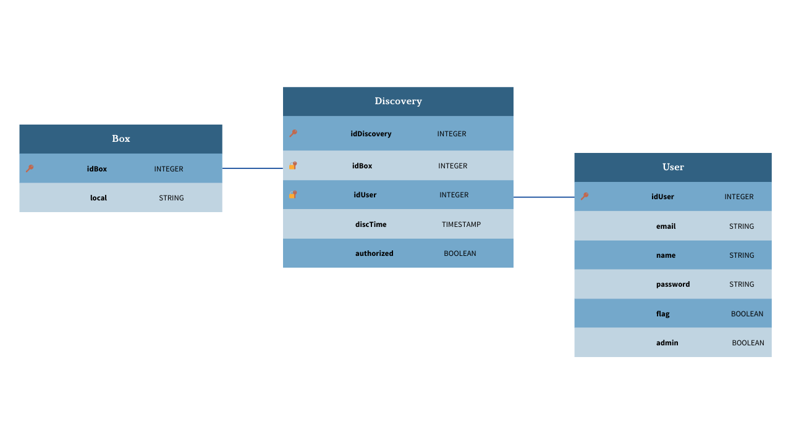
*Figure 1: Database Diagram*

Subsequently, I implemented a backend using NestJS and TypeORM, where each table has APIs for Get, Delete, and Post operations, allowing filtered searches based on different attributes. After successfully implementing the backend locally, I followed a tutorial [here](https://betterprogramming.pub/nest-js-project-with-typeorm-and-postgres-ce6b5afac3be) to develop the frontend.
## Frontend Development

To provide the administrator with a real-time interface of user discoveries, I created an Angular project following the tutorial [here](https://angular.io/tutorial/tour-of-heroes/toh-pt0). The frontend includes three pages (login, sign up, and History), restricted to the login of administrative accounts with data validation for inputted information. The interface was designed to provide an overview of user activities.

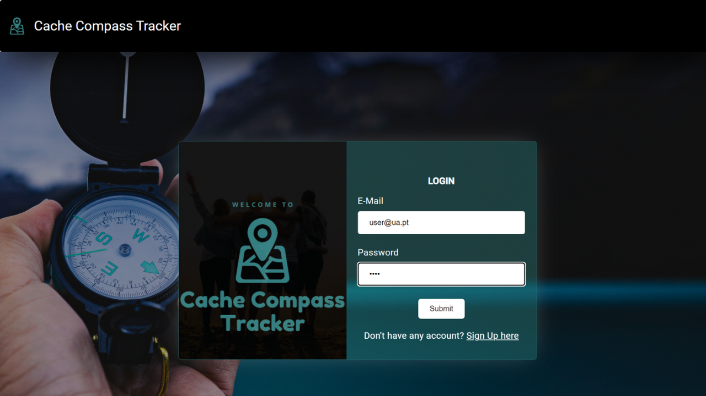
*Figure 2: Login Page*

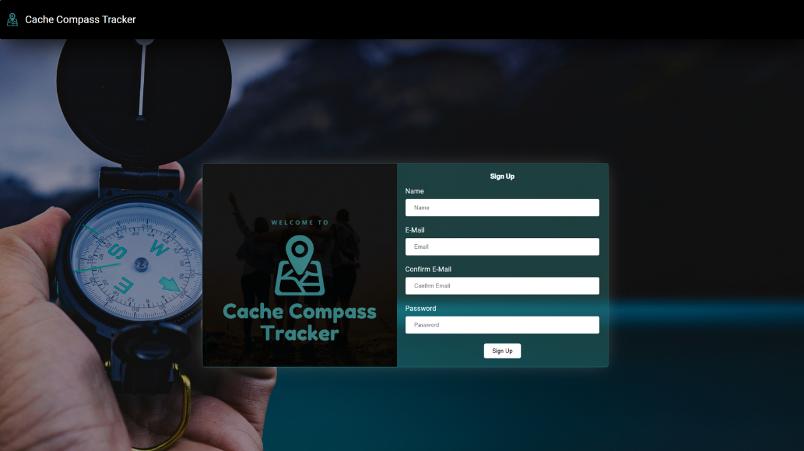
*Figure 3: Sign Up Page*

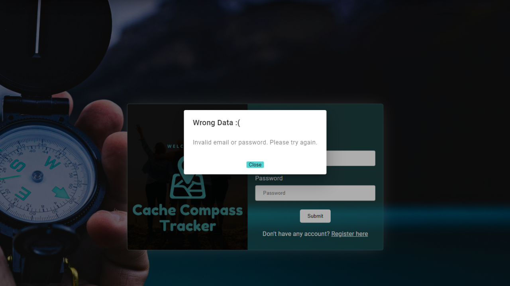
*Figure 4: Invalid Data Alert*

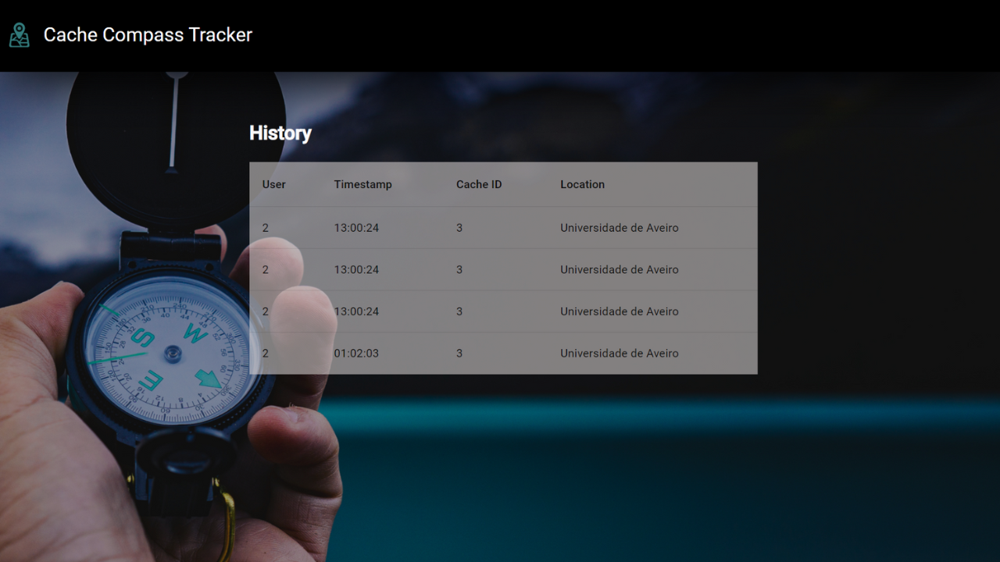
*Figure 5: History Panel*

## Frontend and Backend Integration

By using the HttpClient library in the Angular project, I connected the frontend to the backend. I successfully implemented APIs to verify login, add new users (SignUp), and obtain real-time data for the history page. However, when running the project on multiple browsers, we encountered the error 'Access to XMLHttpRequest has been blocked by CORS policy: No ‘Access-Control-Allow-Origin’ header present.' To overcome this issue, we researched solutions [here](https://www.bannerbear.com/blog/what-is-a-cors-error-and-how-to-fix-it-3-ways/) and added CORS settings to the main.ts file in the backend.


```typescript
const CORS_OPTIONS = {
  origin: true,
  allowedHeaders: [
    'Origin',
    'X-Requested-With',
    'Accept',
    'Content-Type',
    'Authorization'
  ],
  methods: ['GET', 'PUT', 'OPTIONS', 'POST', 'DELETE'],
};

async function bootstrap() {
  const app = await NestFactory.create(AppModule);

  app.enableCors(CORS_OPTIONS);

  app.useGlobalPipes(new ValidationPipe({ whitelist: true, transform: true }));

  await app.listen(3000, '0.0.0.0', () => {
    console.log('[WEB]');
  });
}

bootstrap();
```
This addition to the main.ts file allowed proper access from the frontend to the backend, resolving the CORS issue and ensuring the correct display of data in the developed interface.


### Deployment on AWS

To enable the interaction of the Android application with the same database and verify users, we deployed the backend on AWS, following [this tutorial](https://ututuv.medium.com/deploying-nestjs-api-on-aws-ec2-rds-using-ubuntu-server-and-pm2-82f9bb8d996). Initially, we created a PostgreSQL database on Amazon RDS, and then updated the backend's development.env file with the new database details. I cloned the repository with the latest Backend code on the AWS EC2 instance, and when running the same code that worked locally, I encountered the following error:

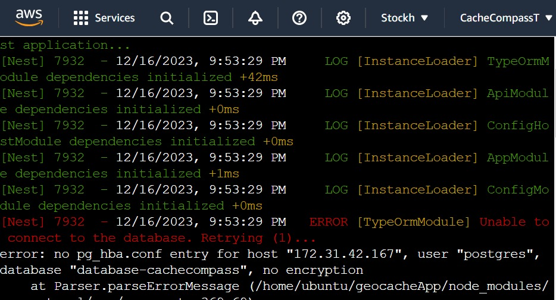
*Figure 6: Unable to connect to the database error*

Considering that I was working on an AWS EC2 instance trying to connect to an AWS RDS, files like pg_hba.conf are not available, so their content corresponds to multiple configurations available in the AWS RDS instance definition. After multiple searches, I concluded that this error is common locally and can be resolved by changing the pg_hba.conf file. Since the file is not available, I tried to change the Security Groups of the database, defining the range of IPs, or specific IPs that can or cannot access the RDS instance. However, when I used the EC2 to connect to RDS, it allowed access, but when I ran the Backend, it blocked the same IP. Therefore, the error was not related to Security Group permissions:

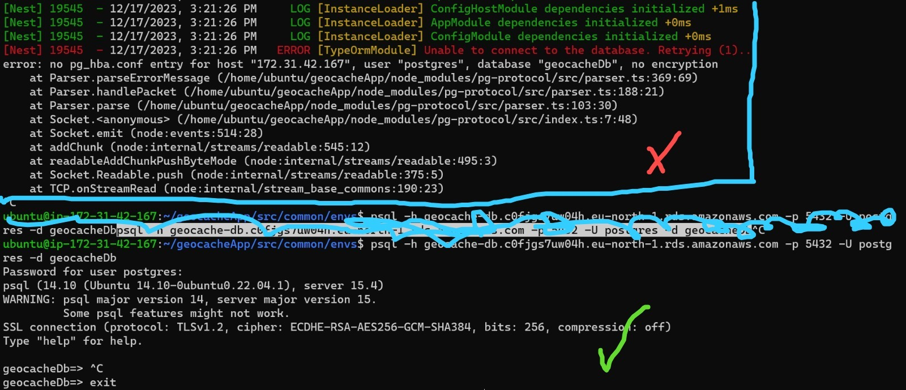
*Figure 7: Error Debugging*

I also tried turning off the database encryption, among other configurations that also did not allow EC2 access to the RDS instance. Considering that the error indicates something related to encryption, upon carefully observing the default settings of a Postgres RDS instance in version 15.2, I found that the parameter rds.force_ssl was set to 1.

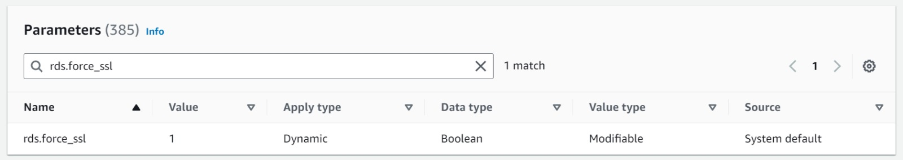
*Figure 8: RDS instance default Parameters*

Changing the rds.force_ssl parameter from 1 to 0 was necessary to allow proper communication between the Amazon EC2 instance and the PostgreSQL database hosted on Amazon RDS. By setting rds.force_ssl to 0, we disabled the requirement for secure SSL connections. This change allowed the EC2 to connect to the database without errors related to encryption, ensuring an efficient and successful integration between the two instances.

Thus, it was possible to run the Backend correctly on the AWS EC2 instance:

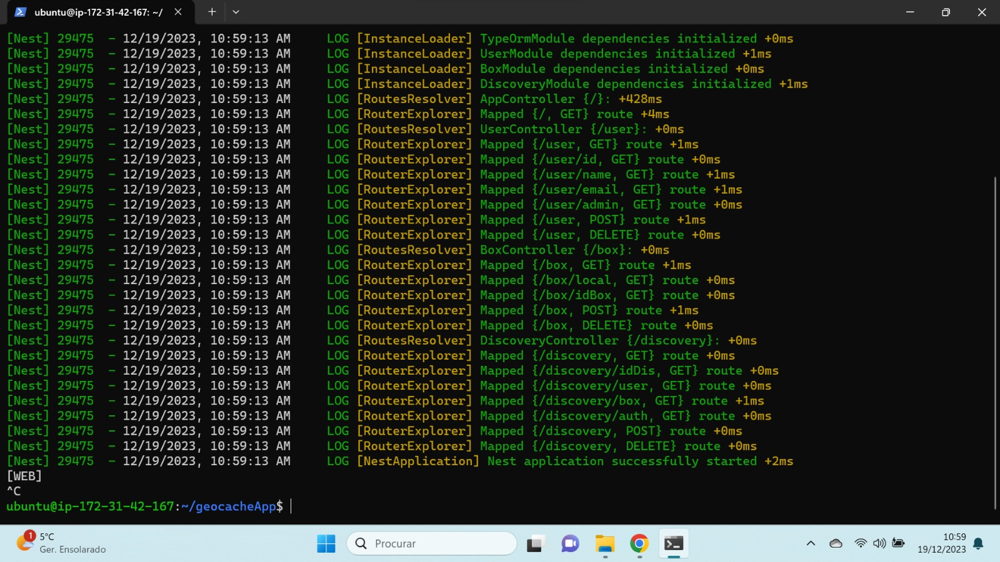
*Figure 9: Backend running successfully at EC2 instance*

However, despite adapting the settings related to Security Groups, namely Inbound and Outbound Rules, as indicated in *Figure 10* and *Figure 11*, when using the University of Aveiro (UA) network, we encountered a limitation that prevented access to the deployed backend's IP address for security reasons.

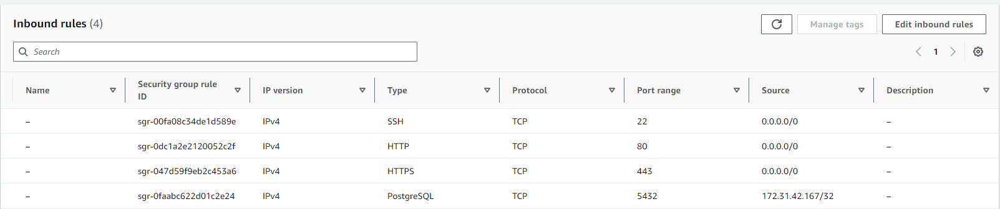
*Figure 10: EC2 Instance Inbound Rules*

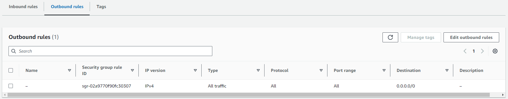
*Figure 11: EC2 Instance Outbound Rules*

This restriction occurs due to the absence of encryption and SSL, considering the IP as insecure. As a result, we can only access the system hosted in the cloud from networks external to UA. This limitation also proved to be an obstacle for group work since the UA network prevents access to the mentioned backend. This highlights the need to implement additional security measures or seek alternatives to enable access from this specific environment.

# How to Run the WebApp Locally

This WebApp consists of two folders: 'front' (frontend) and 'geocache-app' (backend).

## Prerequisites
- Basic understanding of Node.js, TypeScript, and PostgreSQL.
- Visual Studio Code as the code editor.

## How to Run

### Backend Setup
1. **Clone the backend repository:**
    ```bash
    git clone ...
    cd CacheCompass_Tracker\WebSite\geocache-app
    ```

2. **Install dependencies:**
    ```bash
    npm install
    ```

3. **Configure Database:**
    - Create your database in pgAdmin and open `common/envs/development.env` to update the database connection details.
    ```json
    PORT=3000
    BASE_URL=http://localhost:3000

    DATABASE_HOST= ...
    DATABASE_NAME= ...
    DATABASE_USER= ...
    DATABASE_PASSWORD= ...
    DATABASE_PORT= ...
    ```

4. **Start the Backend Server:**
    ```bash
    npm run start
    ```

### Frontend Setup
1. **Clone the frontend repository:**
    ```bash
    git clone ...
    cd CacheCompass_Tracker\WebSite\front\geocache
    ```

2. **Install dependencies:**
    ```bash
    npm install
    ```

3. **Run the Angular App:**
    ```bash
    ng serve -o
    ```

4. **Open in Browser:**
    Open your browser and navigate to `http://localhost:4200/` to view the Cache Compass Tracker.

