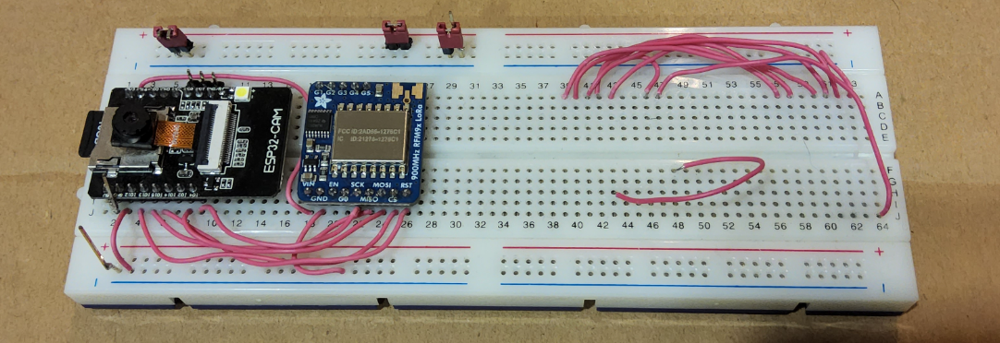

# Deployed Nodes

In this section we'll be approaching our systems deployed nodes, which are comprised of the GeoCache and a Broker. This nodes will be present in the field/real-world and will be used to connect with the companies network, to authorize or deny a user to access the GeoCache. The architecture of the system, including a basic role and the communication method can be observed in the following image:


---
# Development Environment
The systems developed in this sections are [ESP32-DEVKITC](https://www.digikey.pt/pt/products/detail/espressif-systems/ESP32-DEVKITC-32D/9356990?utm_adgroup=&utm_term=&productid=9356990&utm_content=&gad_source=1) and [ESP32CAM](https://www.ptrobotics.com/sensor-camera/7112-esp32-cam-wifi-and-bluetooth-module-w-camera-ov2640-2mp.html) micro-controllers. This devices are cheap, available and being based on the ESP32 **MCU**, offer WiFi and Bluetooth built-in. [^1]

The ESP32 can be programmed using the VSCode plugin [ESP-IDF](https://docs.espressif.com/projects/esp-idf/en/latest/esp32/get-started/index.html#introduction), which enables to program directly in the board native functions and registers, with no framework or translation layer.
However, in our case, we chose to develop using the [Arduino Framework](https://www.arduino.cc/) directly in VSCode, with the [PlatformIO](https://platformio.org/)  plugin. This approach allowed use to developed, flash and monitor code for the ESP32 all in one platform.

In the upcoming sections analyzing the work done, we urge the reader to give a sneak-peak specially in the `Header`, which have appropriate documentation describing the goal of each method and class, as well as the `Src` or *source-code* , which contains all the code to implement the desired outcome of the functions/classes.

---
# BLE Concepts

## Why BLE?

In geocaching is very important for the people playing to be able to guide themselves with some mechanism helping through the path. Normally the technology chosen for this goal is GPS. However, in certain locations the GPS signal might be weak or inexistent, leading to more difficulties on finding the stashes by the players.
Bluetooth Low Energy (BLE) comes in clutch in this situation, since it can be used between two devices with it, meaning we can use it to create a communication between the cache and the user's phone. This way, when the user gets close enough of the BLE range, he can be guided to reach the cache, eliminating concernings about potential GPS malfunctions.

Another problem with the usual geocaching is that bad actors can access the geocache, removing the items from it and not placing anything for the next people to find.
With our idea, this can be solved. Only when the person is really close to the cache, and confirms that they have found it, the cache opens. By clicking the confirmation button, this person's information will be sent from the it's BLE device to the BLE server. This information will then be sent using LoRa in order to review it and classify the person as authorized, or not, to open the cache.
This way, people not using the app or that are non-authorized, can not take what's inside the cache. 


## Concepts

### Server and Client

In a BLE ecosystem, there are two roles: the server and the client. At the start we created two projects, one for the client and other for the server using two ESP32s, leveraging their capability to function as both sides. A BLE server is capable of advertising its presence to potential clients and holds data that can be read or modified by the latter. Upon detecting a server, the client can form a connection and begin receiving or sending data, enabling point-to-point communication.

Other communication modes include:

- Broadcast mode: where a server sends data to multiple clients.
- Mesh network: a complex system where multiple devices are interlinked, allowing many-to-many connections.

### GATT

GATT (Generic Attributes) outlines how BLE devices exchange data through a hierarchical structure. This architecture comprises profiles, services, characteristics, and descriptors, with each layer possessing a unique UUID (Universally Unique Identifier) for identification purposes. Below is a depiction of the BLE hierarchy.


Hierarchical Elements:

- Profile: A standardized suite of services for a specific application.
- Service: A bundle of related functionalities, like sensor data or battery levels.
- Characteristic: The data container within a service.
- Descriptor (Optional): Supplementary information about the characteristic.
- Properties: Interaction rules for the characteristic value, such as read, write, notify, etc.

Each service within a BLE profile comprises at least one characteristic, though it may also reference other services. A characteristic is intrinsically linked to a service and serves as the repository for actual data within the hierarchy, known as the characteristic value. In addition to the characteristic value, every characteristic includes a characteristic declaration, which offers metadata about the data it represents.

The properties describe how the characteristic value can be interacted with. Basically, it contains the operations and procedures that can be used with the characteristic:

- Broadcast
- Read
- Write without response
- Write
- Notify
- Indicate
- Authenticated Signed Writes
- Extended Properties

Of these, we only use "read" and "write", as you can see in the code below used on server.

Each service, characteristic, and descriptor have a UUID (Universally Unique Identifier). A UUID is a unique 128-bit (16 bytes) number with this the uuid can identify a particular service provided by a Bluetooth device. We generated our UUIDs on [UUID Generator Site](https://www.uuidgenerator.net). Here's an example where we used it on code:

```cpp
#define SERVICE_UUID        "4fafc201-1fb5-459e-8fcc-c5c9c331914b"
#define CHARACTERISTIC_UUID "beb5483e-36e1-4688-b7f5-ea07361b26a8"
```

The following code outlines the server setup process in ESP32:

```cpp
void BleServer::setup() {
    String deviceName = "GeoCache_" + String(nodeId);
    BLEDevice::init(deviceName.c_str());
    pServer = BLEDevice::createServer();
    pService = pServer->createService(SERVICE_UUID);
    pServer->setCallbacks(new MyBLEServerCallbacks(this));
    pCharacteristic = pService->createCharacteristic(
        CHARACTERISTIC_UUID,
        BLECharacteristic::PROPERTY_READ | BLECharacteristic::PROPERTY_WRITE);
    //pCharacteristic->setMTU(512); // Set your desired MTU size here - only for BT 5.0 and above
    pCharacteristic->setValue("/");
    pService->start();
    BLEAdvertising* pAdvertising = BLEDevice::getAdvertising();
    pAdvertising->addServiceUUID(SERVICE_UUID);
    pAdvertising->setScanResponse(true);
    pAdvertising->setMinPreferred(
        0x06);  // functions that help with iPhone connections issue
    pAdvertising->setMinPreferred(0x12);
    BLEDevice::startAdvertising();
    
    Serial.println("BLE, Gateway visible to other ble devices!");
    Serial.println();
}
```
In the setup, we created a BLE device called "Geocache_" followed by node ID. This BLE device would act as a server. After creating the BLE server, we also created a service with the UUID defined as above. Then we set the characteristic for that service. Finally we started the service, and also advertising it, so other BLE devices can scan/find and access the service provided by this BLE device.

Firstly, to test the communication we used a application named "nRF Connect" and we confirm that the results were shown in the image below.


### RSSI

Received Signal Strength Indicator (RSSI) is a crucial component in Bluetooth Low Energy (BLE) applications for estimating the proximity of devices. In the context of BLE-based geocaching, RSSI is instrumental in guiding users to the location of a geocache, especially in environments where GPS signals may be unreliable. This signal strength measurement enables a user's device to determine how close it is to the geocache, with higher RSSI values indicating lower distance so more closer.

To translate the RSSI into a distance measurement, a commonly used formula takes into account the signal strength at a one-meter distance, known as Measured Power, and the environmental factor N, which accounts for the signal's decrease over distance.

The formula is as follows:


In this formula, Measured Power is a factory-calibrated constant indicating the RSSI value at a one-meter distance from the beacon. RSSI is the current signal strength measured by the receiver. The N factor represents the signal propagation constant or path-loss exponent, which varies depending on environmental factors like walls and other obstacles that could attenuate the signal.

As we said in the explanation of the formula, RSSI is not without its challenges. The signal strength can be significantly affected by various environmental factors, including physical obstructions, interference from other electronic devices, and the materials the signal must pass through. Additionally, the RSSI value can fluctuate if either the user's device or the geocache beacon is moving, leading to potentially inconsistent distance readings. The orientation of the transmitting and receiving antennas also impacts the RSSI, as certain angles may weaken the perceived signal strength.

Despite these challenges, advancements in filtering and processing techniques have improved the reliability of RSSI-based distance estimations. Kalman filters, for example, have been employed to smooth out the signal variance, resulting in more stable RSSI readings. Moreover, the use of a Measured Power constant, which is a factory-calibrated value representing the expected RSSI at one meter from the beacon, enhances the accuracy of these estimations.

The integration of these enhancements with trilateration algorithms has led to better localization performance. However, it's important to note that there can still be a notable error margin. In testing scenarios within controlled environments, the average error was found to be approximately 13.7%, illustrating that while effective, RSSI-based localization should be implemented with an understanding of its limitations.

While RSSI is a beneficial tool for BLE-based geocaching, providing a low-cost and energy-efficient solution, it requires careful calibration and filtering to counteract environmental effects and signal fluctuations. These improvements are vital for developing a robust and reliable geocaching experience where traditional GPS may fall short.


### BLE Notify (Our method) and User's message to the server

BLE Notify is a feature of the BLE protocol that allows a BLE peripheral device to asynchronously notify a connected device, about changes in it's characteristics, for example. 
We decided to implement a simplified method instead of using this feature.

Before we present our idea, we need to understand the format of the messages we are sending to the server when the user finds the cache. The packet format is shown below:


The two most important fields for our explanation are the packet and user ID's, since the header is only used to occupy an empty space to make sure the message has the correct format and the type corresponds to an opening request.

The reason of having a packet ID will be described on the next paragraph. The User ID is used to identify the person playing and making sure they have the right to access the cache.

Now that the message form is presented, we can go through our BLE notify replacing method.
When the user founds the cache and their information is sent to the server, by writing on the server's characteristic, the server needs a way of knowing the data has been updated. Our way of doing this was having a packet ID field which will certainly be different for every message sent. The packet ID is incremented every time the user sends a message. When the server receives the information, it verifies if the value on the characteristic has changed or not, guarantying that if it has, the new information is processed.

The function below illustrates the server's procedure for verifying changes in data:

```cpp
uint8_t* BleServer::read(uint8_t* len) {
    uint8_t* value = pCharacteristic->getData();

    if (value[0] != 0x2f && connected) {
        *len = pCharacteristic->getLength();
        // Check if the value received is different from the previous
        if (memcmp(value, previousValue, *len) != 0) {
            // Update previous value
            memcpy(previousValue, value, *len);
            // Return the new value
            return value;
        }
        return nullptr;
    }

    return nullptr;
}
```

We came into the conclusion that our method is not the best way to do this but we used it as a workaround in order to do it faster. Ideally, the client should use BLE notify to inform the data has been changed on that characteristic.

## GeoCache

The GeoCache is the node that represents and interacts with the items and the compartment itself. It's responsible to:
* Be visible and be visible to be found and located by an user
* Exchange authorization information with the user and the Geocaching network, by intermediary of the Broker
* If the user was authorized, open the Box for him to interact and then close it

As can be viewed in the image bellow, this node uses three communication technologies, BLE, WiFi and LoRa. Each of this technologies and their objectives will be developed in the following sections.


The final appearance of the GeoCache can be viewed in the following images:

|  |  |
| --------------- | --------------- |

<!--
<p float="left">
    
    
</p>-->

According to the **Arduino** Framework structure, the main file containing the code of the ESP32 has to have a `setup` and `loop` functions, which will configure the micro-controller and execute repeated tasks, respectively. This function is located in the [geocache folder](./geocache/src/main.cpp) and it's worth noting the configuration order of the services:
```c++
void setup() {
    // Initialize Serial Monitor
    Serial.begin(115200);
    while (!Serial)
        ;
    Serial.println("GeoCache Terminal ready");
    Serial.println();

    // Setup BLE Server
    bleServer.setup();

    // Setup wifi with box opener
    wifiClient.connect();

    // Setup LoRa868
    while (!lora.configure(VERBOSE))
        delay(3000);

    // Create LoRa Task to receive data
    //xTaskCreate(receive_lora, "receive_lora", 8000, NULL, 1, &loraTask);

    // Create BLE Task to receive data
    xTaskCreate(receive_ble, "receive_ble", 8000, NULL, 1, &bleTask);

    Serial.println();
}
```

### Communication with User Device

The GeoCache establishes communication with the User Device using BLE. It creates a BLE Server with the name **GeoCache_x** where `x` is the node id of the GeoCache.
The User Device can then scan for the GeoCaches with the configured name and upon connection can verify their authenticity by connection to the right `service.characteristic` **Universally Unique Identifier (UUID)**.

#### BLE

Following an object-oriented approach and a good development structure in C/C++, we kept separate files for the declarations and source code. The [header](./geocache/include/bleServer.h) is located at `./geocache/include/bleServer.h` and [src](./geocache/src/bleServer.cpp) at `./geocache/src/bleServer.cpp`.
Analyzing the `BleServer` class, we first have macros to define the maximum **MTU** for the ESP32, as well as for our **Service** and **Characteristic**:
```c++
//! Maximum Transmission Unit for BLE communication, it's 251 since esp32s
//   have Bluetooth 4.2
#define BLE_MTU 251
//! Unique identifier for the BLE service
#define SERVICE_UUID "4fafc201-1fb5-459e-8fcc-c5c9c331914b"
//! Unique identifier for the BLE characteristic
#define CHARACTERISTIC_UUID "beb5483e-36e1-4688-b7f5-ea07361b26a8"
```

Then we have the `callbacks` which are part of the `BleServer` class and used just to signal the server that can be used to trigger certain operations in the server, when a signal from the client is received. In this case we are only using it to signal that a client has connected/disconnected from the Server:
```c++
/*! \class MyBLEServerCallbacks
    \brief Callbacks for BLE server events.
*/
class MyBLEServerCallbacks : public BLEServerCallbacks {
    /*!< pointer to the parent BleClient object. */
    BleServer* parent;

    public:
    /*! \brief Constructor for MyBLEServerCallbacks.
        \param parent A pointer to the parent BleClient object.
    */
    MyBLEServerCallbacks(BleServer* parent) : parent(parent) {}

    /*! \brief Handles connection event.
        \param pServer Pointer to the BLE server.
    */
    void onConnect(BLEServer* pServer) { parent->connected = true; }

    /*! \brief Handles disconnection event.
        \param pServer Pointer to the BLE server.
    */
    void onDisconnect(BLEServer* pServer) {
        parent->connected = false;
        BLEDevice::startAdvertising();
    }
};
```

The configuration/setup of the BLE server starts by creating the Server with the defined name, creating the Service, setting up callbacks and then configuring the Characteristic. The remaining steps are just setting up a default value of the characteristic, start the service and then just configurations for better scanning:
```c++
void BleServer::setup() {
    String deviceName = "GeoCache_" + String(nodeId);
    BLEDevice::init(deviceName.c_str());
    pServer = BLEDevice::createServer();
    pService = pServer->createService(SERVICE_UUID);
    pServer->setCallbacks(new MyBLEServerCallbacks(this));
    pCharacteristic = pService->createCharacteristic(
        CHARACTERISTIC_UUID,
        BLECharacteristic::PROPERTY_READ | BLECharacteristic::PROPERTY_WRITE);
    //pCharacteristic->setMTU(512); // Set your desired MTU size here - only for BT 5.0 and above
    pCharacteristic->setValue("/");
    pService->start();
    BLEAdvertising* pAdvertising = BLEDevice::getAdvertising();
    pAdvertising->addServiceUUID(SERVICE_UUID);
    pAdvertising->setScanResponse(true);
    pAdvertising->setMinPreferred(
        0x06);  // functions that help with iPhone connections issue
    pAdvertising->setMinPreferred(0x12);
    BLEDevice::startAdvertising();
    
    Serial.println("BLE, Gateway visible to other ble devices!");
    Serial.println();
}
```

Some of the code used here as gathered from arduino example for BLE by Evandro Copercini and Neil Kolban [^2] and tutorial by MoThunderz [^3]

#### Message Types

Located in the `shared/message` folder is the **BleMessage** class, which creates and stores in the ESP32 *heap* a message. The [Header](./shared/message/include/message.h) and [Src](./shared/message/src/message.cpp) are located in the same folder.

Theres only two message types:
* **open_request**, to ask the GeoCache to open and has the following fields:
    * *Message Type*: 2 bytes
    * *Packet ID*: 4 bytes
    * *User ID*: 2 bytes
* **open_response**: GeoCache transmits the user, the authorization result (not used):
    * *Message Type*: 2 bytes
    * *Packet ID*: 4 bytes
    * *Authorized*: 1 byte

With the use of this classes, to send a message, only the following code would be needed:
```c++
size_t sendMsgSize;
uint8_t* msgToSend = bleMsgClass.open_request(
    sendMsgSize, bleClient.get_packet_count(), USER_ID);

bleClient.send(msgToSend, sendMsgSize);
```

#### Extras

To test the BLE server while the BLE app for Android was being developed, we created the [User Device](./userDevice/src/main.cpp) node, which would connect to the Server and periodically signal it to open the GeoCache. For this, we also developed a **BleClient** class with dedicated [Header](./userDevice/include/bleClient.h) and [Src](./userDevice/src/bleClient.cpp) files. We won't be discussing them here, since the scope of the project would be to work with the BLE app, which is also explained in another section.

### Communication with Broker

The GeoCache communicates with the Broker by LoRa 868 to verify the authenticity of an user and determine if he has authorization to open the GeoCache. Before transmission of a message, the GeoCache sends a `HELLO` message to the Broker and waits for `HELLO_RESPONSE`, which signals that the GeoCache is able to send information.

#### LoRa

Located in the `shared/lora` folder is the **LoRa868** library, as following the same methodology as before, it has separate [Header](./shared/lora/include/lora.h) and [Src](./shared/lora/src/lora.cpp) files.
Since we lacked the number of regular **ESP32-DEVKITC** to be used, we needed to resort to spare **ESP32CAM** micro-controller. This revealed to be a set-back, due to the **ESP32CAM** not having as many available *pins* as the **ESP32-DEVKITC**. 
We needed to modifications the board and remove the transistor from the white LED to free up Pin 4 for SCK [^4] and even then we couldn't allocate an additional interrupt pin to signal the dispatch and reception of packets. So we used the [SX12XX − LoRa library](https://github.com/StuartsProjects/SX12XX-LoRa/tree/master), which circumvents the need
for interrupt pins by directly accessing the internal registers of the *Semtech sx127* chip, bypassing reliance on interrupt routines. 
In our case, SD Card wasn't needed, but this modification will affect scenarios where SD Card and LoRa may be used at the same time. To be able to use them, one needs to be deactivated when the other is in use. Since the SD card is built-in to the board, both reliant on Serial-Programmable Interface (SPI) communication through the Master-Output
Slave-Input (MOSI)/Master-Input Slave-Output (MISO) lines.

The defined pins and definitions for LoRa can be found in the code snippet below:
```c++
//! Select pin on SPI interface
#define NSS 12
//! Reset pin on SPI Interface
#define NRESET 15
//! SCK or clock pin on SPI interface
#define SCK 4
//! MISO or data to master pin on SPI interface
#define MISO 13
//! MOSI or data from master pin on SPI interface
#define MOSI 2
//! pin number for ESP32CAM on board red LED, set logic level low for on
#define REDLED 33
//! Name of the device used
#define LORA_DEVICE DEVICE_SX1278
/*! Although 255 is the maximum packet size, 222 is the maximum size allowed
      by LoraWan (+13 bytes overhead) - https://avbentem.github.io/airtime-calculator/ttn/eu868 */
#define LORA_PAYLOAD 222
```

Since our aim of this project wasn't to test the capabilities of distance and Packet-loss, we went with the lowest **Spreading-Factor** and **Coding-Rate**, as to have low air-time:
```c++
(..)
// Transmission Frequency - 868 MHz
const uint32_t Frequency = 868000000;
// Offset frequency for calibration purposes
const uint32_t Offset = 0;
// LoRa Bandwidth
const uint8_t Bandwidth = LORA_BW_500;
// LoRa spreading factor - SF7 is lowest, which means more data rate, but
//  less range and more prone to errors. SF12 is highest and more robust
const uint8_t SpreadingFactor = LORA_SF7;
// LoRa coding rate
const uint8_t CodeRate = LORA_CR_4_5;
// low data rate optimisation setting
const uint8_t Optimisation = LDRO_AUTO;
// LoRa Tx power
const int8_t TxPower = 10;
// Timeout on Received, to wait for a packet
const uint32_t RxTimeoutMs = 5000;
// Timeout on Transmitter, to wait for a packet
const uint32_t TxTimeoutMs = 2500;
(...)
```

Having LoRa configured, we managed to transfer information, with very low **Average-Packed Delay (APD)**, but with occasional errors. However, since 868 Mhz band is regulated with 1% duty-cycle, we had to implement a duty cycle controller, to guarantee that each second spent transmitting was equivalent to 100 seconds in standby [^6]. Since the LoRa transmit function is program blocking and only returns when the packet is transferred, we timed it’s execution and multiplied it by 100. This way, every time that the send function is called, a `false` is returned in case of error
or duty-cycle is still in effect and `true` if the message was sent successfully:
```c++
(...)
// Check if duty cycle is enabled and if it's still complying with timing constraints
unsigned long elapsedTime = millis() - lastTransmissionTime;
if ((elapsedTime < dutyCycleTime) && dutyCycleEnabled) {
    return false;
}

// Tick time before calling function to send
unsigned long timeBeforeSending = millis();
// Call Blocking function to send the packet to the receiver, which returns
//  the packet length if OK, otherwise 0 if error occurred
uint8_t bytesSent =
    LoRa.transmitIRQ(buffer, size, TxTimeoutMs, TxPower, WAIT_TX);
// Tick time after calling function to send
lastTransmissionTime = millis();

// Calculate duty cycle, according to the time it took to send the packet
dutyCycleTime =
    (lastTransmissionTime - timeBeforeSending) * 100;  // time in seconds
(...)
```

The **LoRa868** class also has methods to configure the *Semtech sx127* chip, send and received messages, determine if an error ocurred in the reception of the packet and to terminate or place the chip in *deep-sleep*.

Some of the core here used was derived from examples in StuartProjects. [^5]

#### Message Types

Located in the `shared/message` folder is the **LoRaMessage** class, which creates and stores in the ESP32 *heap* a message. The [Header](./shared/message/include/message.h) and [Src](./shared/message/src/message.cpp) are located in the same folder.

The LoRa message is implemented by both the Broker and the GeoCache to have a common message structure. There are 5 types of messages used in communications, they are present in the following image:


Each message is used in the following situations:
* **HELLO**: Sent by the GeoCache to signal the need to transmit information
* **HELLO_RESPONSE**: Sent by the Broker to the GeoCache, signalling it's ready to receive information
* **OPENING_REQUEST**: Sent by the GeoCache to the Broker, carrying the information of the user request to open
* **OPENING_RESPONSE**: Sent by the Broker to the GeoCache indicating if the user is authorized ot not
* **OPENING_RESPONSE_ACK**: Sent by the GeoCache to the Broker, informing the correct reception of the **OPENING_RESPONSE** and signalling the conversation flow completion

During development, some issues occurred in this part, due to the nature of memory handling and operation, as can be evidenced by the following code snippet of the `open_request` function:
```c++
uint8_t* LoraMessage::open_request(size_t& size, uint16_t nodeId,
                                   uint32_t packetId, uint16_t userId,
                                   unsigned long timestamp) {
    size = MESSAGE_TYPE_SIZE + MESSAGE_NODE_ID_SIZE + MESSAGE_PACKET_ID_SIZE +
           MESSAGE_USER_ID_SIZE + MESSAGE_TIMESTAMP_SIZE;
    uint8_t tempMessage[MAX_MESSAGE_SIZE];

    // Place the header in the new message
    MESSAGE_TYPE msgType = OPENING_REQUEST;
    memcpy(tempMessage, &msgType, MESSAGE_TYPE_SIZE);
    memcpy(tempMessage + MESSAGE_TYPE_SIZE, &nodeId, MESSAGE_NODE_ID_SIZE);
    memcpy(tempMessage + (MESSAGE_TYPE_SIZE + MESSAGE_NODE_ID_SIZE), &packetId,
           MESSAGE_PACKET_ID_SIZE);
    memcpy(tempMessage + (MESSAGE_TYPE_SIZE + MESSAGE_NODE_ID_SIZE +
                          MESSAGE_PACKET_ID_SIZE),
           &userId, MESSAGE_USER_ID_SIZE);
    memcpy(tempMessage + (MESSAGE_TYPE_SIZE + MESSAGE_NODE_ID_SIZE +
                          MESSAGE_PACKET_ID_SIZE + MESSAGE_USER_ID_SIZE),
           &timestamp, MESSAGE_TIMESTAMP_SIZE);

    return save_message_memory(tempMessage, size);
}
```

### Opening Box

To simulate the GeoCache opening upon the reception of the authorization for an user, we develop a small box with a 9g Servo, which would push the lid of the box, simulating that the user is able to interact with it's insides. Unfortunately, due to the lack of pins referred above, the **ESP32CAM** couldn't directly use an *IO* pin to control the Servo. So we had the idea to use another ESP32 and establish WiFi communication between the ESP32 with LoRa and the other interacting with the Servo.

#### Communication with Box Opener

We established that the GeoCache would be the WiFi client, which would connect the [boxOpener](./boxOpener/src/main.cpp) by an *ad-hoc* network. This way, upon booting up, the client would connect to the server, forming a **peer-to-peer (P2P)** network. As to establish the TCP connection and server, we went with the **AsyncTCP** library, by *esphome* [^7].

The **WifiClient** class is available in the [Header](./geocache/include/wifiClient.h) and [Src](./geocache/src/wifiClient.cpp) files. With the **WifiServer** class also in the same methodology, with separate [Header](./boxOpener/include/wifiServer.h) and  [Src](./boxOpener/src/wifiServer.cpp) files. Both of them have defined the same **SSID**, server **Port** and **MTU**:
```c++
//! Default SSID for AD_HOC network
#define SSID_AD_HOC "ad_hoc_esp32"
//! Default Password for AD_HOC network
#define PASSWORD_AD_HOC "123456789"
//! Server port for the server to be bounded
#define SERVER_PORT 80
//! Maximum Transmission Unit for communication
#define MTU 1500
```

Being *Asynchronous* server and client, their functioning is based on callbacks, which determines what to execute in certain situations. For example, in the following code snippet, we can see that the Client is binding an `on_receive` function when any data is received from the client:
```c++
// Create a lambda function that captures 'this' and calls 'on_receive'
//  --> because callbacks can't access non-static functions directly
auto onDataCallback = [this](void* arg, AsyncClient* client, void* data,
                                size_t len) {
    this->on_receive(arg, client, data, len);
};

// Bind the lambda function to 'client.onData'
client.onData(onDataCallback, this);

while (!client.connect(serverIP, SERVER_PORT)) {
    Serial.print("Attempting to connect to Server IP: ");
    Serial.print(serverIP);
    Serial.print(", Port: ");
    Serial.println(SERVER_PORT);
    delay(1000);
}
```

#### Messages

Since we are dealing with *ad-hoc* communication between the two board, and the only interaction would be for the ESP32 with LoRa to signal the ESP32 with Servo to open the box, we made as to any message received by the ESP32 with servo would trigger the opening of box. This message can be viewed in the `ping` function:
```c++
void WifiClient::ping() {
    uint8_t message[6];

    message[0] = packetCounter;
    message[1] = 'H';
    message[2] = 'e';
    message[3] = 'l';
    message[4] = 'l';
    message[5] = 'o';

    send(message, 6);
}
```

#### Servo

To interact with the servo, after many attempts, we chose the **ESP32Servo** library, by *madhephaestus*. This allowed us to implement in the [BoxOpener](./boxOpener/src/main.cpp) the library seamlessly. 
As present above, in the images of the final product, a *three-state* button can also be viewed. We use this button to adjust the position of the servo, this is because we are using a *360º* Servo, which works with rotation time, not angle. This made our work a lot harder, because, probably due to not using the correct power-source (in our case 5v from our laptop usb, dedicated only to the servo, because the ESP32 could only supply 3v3), the servo position wasn't linear. For example, we would rotate Counter-clockwise 200ms and the servo would stop at 45º, but the same time for clockwise would only rotate *35-40º*. In the code itself, we started by defining PINs and servo full-rotation time:
```c++
#define PIN_SERVO 13
#define MIN_SERVO_US 1000  // 500 default
#define MAX_SERVO_US 2000  // 2400 default
#define PIN_SWITCH 14
```

In the programs `loop` function, we check if it has received an order by WiFi. If it hasn't, we check the switches state, if it's required to open or close the box. If an order to open has been received, it'll open the Box for roughly `5` seconds and then proceed to close it. This code can be found below:
```c++
void loop() {

    if (!wifiLock) {
        int switchValue = digitalRead(PIN_SWITCH);
        // switchValue == HIGH -> on
        // switchValue == LOW -> off

        Serial.printf("Switch is %d and box is %d", switchValue, boxClosed);
        Serial.println();

        if (switchValue == HIGH && boxClosed) {
            open_box();
            boxClosed = false;
        } else if (switchValue == LOW && !boxClosed) {
            //close_box();
            boxClosed = true;
        }
    } else {

        if (counter >= 50) {
            close_box();
            boxClosed = true;
            wifiLock = false;
            counter = 0;
        } else {
            Serial.printf("Counter is %d", counter);
            Serial.println();
        }
        counter++;
    }

    vTaskDelay(pdMS_TO_TICKS(100));
}
```

**Note**: Before integrating the Servo into the **BoxOpener**, we developed the [boxTester](./boxTester/boxTester.ino) *Arduino* project, to test the Servo library and functions.

---
## Broker

The Broker is the node that that interacts with the GeoCache and the AWS backend server of the company. It's responsible to:
* Be ready to receive information from the GeoCache
* Query the AWS backend to determine if an user is authorized to open the GeoCache
* Upon reception of the authorization, signal it to the GeoCache and in case if the user is authorized, `POST` in the backend that the user has opened the box

As can be viewed in the image bellow, this node uses two communication technologies, WiFi and LoRa. We'll only be approaching the communication over WiFi with AWS in the next sections, as LoRa as already been explained in the **GeoCache** section.


The final appearance of the Broker can be viewed in the following image:



According to the **Arduino** Framework structure, the main file containing the code of the ESP32 has to have a `setup` and `loop` functions, which will configure the micro-controller and execute repeated tasks, respectively. This function is located in the [broker folder](./broker/src/main.cpp) and it's worth noting the configuration order of the services:
```c++
void setup() {
    // Initialize Serial Monitor
    Serial.begin(115200);
    while (!Serial)
        ;
    Serial.println("Broker Terminal ready");
    Serial.println();

    // Setup webAPI
    webAPI.connect_wifi();

    // Setup LoRa868
    while (!lora.configure(VERBOSE))
        delay(3000);

    // Create LoRa Task to receive data
    //xTaskCreate(receive_lora, "receive_lora", 8000, NULL, 1, &loraTask);

    Serial.println();
}
```

### Communication with AWS

Upon reception of a message by LoRa, the Broker will evaluate and process it according to it's type, as we can see in the `process_lora_message` function:
```c++
void process_lora_message(uint8_t* message, uint8_t size) {
    // Received message general info
    MESSAGE_TYPE type = msgClass.get_type(message, size);
    uint16_t nodeId = msgClass.get_node_id(message, size);
    uint32_t packetId = msgClass.get_packet_id(message, size);

    // Message to send variables
    size_t sendMsgSize;
    uint8_t* msgToSend;

    Serial.print("LoRa868, Received message from GeoCache: ");
    Serial.println(msgClass.to_string(message, size));

    if (type == HELLO) {
        msgToSend = msgClass.hello_response(sendMsgSize, nodeId, packetId);

    } else if (type == OPENING_REQUEST) {
        uint16_t userId = msgClass.get_user_id(message, size);
        unsigned long timestamp = msgClass.get_timestamp(message, size);

        // call remote service
        Serial.println("Http, Starting requests for user authorization");
        bool authorized = webAPI.request_user_authorized(userId);
        webAPI.post_discovery(nodeId, userId, timestamp, authorized);
        Serial.println("Http, all requests completed");
        Serial.println();

        msgToSend =
            msgClass.open_response(sendMsgSize, nodeId, packetId, authorized);
    } else if (type == OPENING_RESPONSE_ACK) {
        return;
    } else if (type == HELLO_RESPONSE || type == OPENING_RESPONSE) {
        ;  // do nothing
        return;
    } else {
        Serial.println("Error: Unknown message type");
        return;
    }

    // Send response to GeoCache
    lora.send(msgToSend, sendMsgSize);

    (...)
}
```


Pointing out the `OPENING_REQUEST` type, the Broker will use our **WebAPI** class defined in separate [Header](./broker/include/webAPI.h) and [Src](./broker/src/webAPI.cpp) files.

In this class, we start by defining the WiFi network *SSID* and Password (needs internet access), as well as the *URL* for the AWS instance. Then the path of the requests/post will be making:
```c++
//! SSID of your internet enabled WiFi network
const char WIFI_SSID[] = "YOUR_WIFI_SSID";  // CHANGE IT
//! Password of your internet enabled WiFi network
const char WIFI_PASSWORD[] = "YOUR_WIFI_PASSWORD";  // CHANGE IT
//! URL or Host name of the API service
const String HOST_NAME = "http://51.20.64.70:3000";
//! Path of the request of user by Id
const String USER_ID_PATH_NAME = "/user/id";
//! Query variables of the request of user by Id
const String USER_ID_QUERY_VARS = "id=";
//! Path of the request of discovery
const String DISCOVERY_PATH_NAME = "/discovery";
```

Since the Backend server developed in AWS uses the *JSON* format to communicate over *HTTP*, we used the **Arduino_JSON** library, by *Arduino Libraries*. [^10]
With this library, placing GET's and POST's is a lot easier, as can be viewed by `request_user_authorized` and `post_discovery`, which will query if the user is authorized and post if the user has opened the box, respectively:
```c++
bool WebAPI::request_user_authorized(uint16_t userId) {
    String infoString = HOST_NAME + USER_ID_PATH_NAME + "?" +
                        USER_ID_QUERY_VARS + String(userId);

    Serial.println(" - Query URL: " + infoString);

    http.begin(infoString);
    http.addHeader("Content-Type", "application/x-www-form-urlencoded");

    int httpCode = http.GET();
    bool authorized = false;

    // httpCode will be negative on error
    if (httpCode > 0) {
        // file found at server
        if (httpCode == HTTP_CODE_OK) {
            String payload = http.getString();
            Serial.println(" - Received payload:" + payload);

            JSONVar response = JSON.parse(payload);

            if (JSON.typeof(response) == "array") {

                authorized = response[0]["flag"];
                Serial.printf(" - User is %s to access geocache",
                              authorized ? "Authorized" : "Unauthorized");
                Serial.println();
            }
(...)
}

bool WebAPI::post_discovery(uint16_t nodeId, uint16_t userId,
                            unsigned long timestamp, bool authorized) {

    String infoString = HOST_NAME + DISCOVERY_PATH_NAME;

    Serial.println(" - Posting Discovery to URL:" + infoString);

    http.begin(infoString);
    http.addHeader("Content-Type", "application/json");

    JSONVar discData;
    discData["box"] = nodeId;
    discData["user"] = userId;
    discData["discTime"] = get_time_string(timestamp);
    discData["authorized"] = authorized;

    String jsonString = JSON.stringify(discData);
    Serial.println(" - Post data: " + jsonString);
    int httpCode = http.POST(jsonString);

    bool status = false;

    // httpCode will be negative on error
    if (httpCode > 0) {
        // file found at server
        if (httpCode == HTTP_CODE_OK || httpCode == 201) {
            Serial.println(" - Post executed successfully ");
            status = true;
        } else {
            // HTTP header has been send and Server response header has been handled
            Serial.printf(" - [HTTP] GET... code: %d", httpCode);
            Serial.println();
        }
    } else {
        Serial.printf(" - Error: HTTP, GET... failed: %s",
                      http.errorToString(httpCode).c_str());
        Serial.println();
    }

    http.end();

    return status;
}
```

Some of the core here used was derived from examples in ESP32IO. [^9]

**Note**: Before integrating the HTTP library into the **Broker**, we developed the [httpRequester](./httpRequester/httpRequester.ino) *Arduino* project, to test the HTTP library and functions.

---
## Results and Analysis

It's our conviction that the work developed in this chapter was fruitful and revealed deeper insights into the world of not only embedded devices, but communication technologies. It proved to be challenging to developed and interact with all the technologies mentioned. The biggest problems we had were working with LoRa especially configuring it in the **ESP32CAM**, with it's limited pin layout and communicating with the BLE app. However, our previous knowledge of some of the technologies here and basic network architecture and design principles enabled us to overcome the challenges posed.

---
# References

[^1]: ESP32 product page: https://www.espressif.com/en/products/socs/esp32
[^2]: BLE example: https://github.com/nkolban/esp32-snippets/blob/master/cpp_utils/tests/BLE%20Tests/SampleServer.cpp
[^3]: BLE tutorial: https://www.youtube.com/watch?v=0Yvd_k0hbVs&t=138s
[^4]: ESP32CAM with SX127: https://stuartsprojects.github.io/2022/02/05/Long-Range-Wireless-Adapter-for-ESP32CAM.html
[^5]: StuartProjects examples: (https://github.com/StuartsProjects/Devices/tree/master)
[^6]: Airtime calculator for LoRaWAN: https://avbentem.github.io/airtime-calculator/ttn/eu868
[^7]: Async TCP by esphone: https://registry.platformio.org/libraries/esphome/AsyncTCP-esphome
[^8]: ESP32Servo by madhephaestus: https://registry.platformio.org/libraries/madhephaestus/ESP32Servo
[^9]: ESP32io: https://esp32io.com/tutorials/esp32-http-request
[^10]: Arduino JSON: https://registry.platformio.org/libraries/arduino-libraries/Arduino_JSON