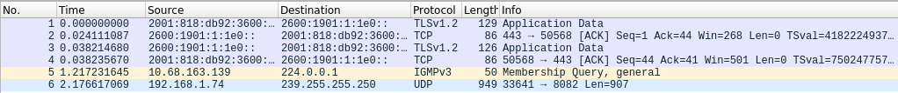
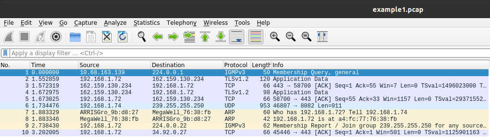
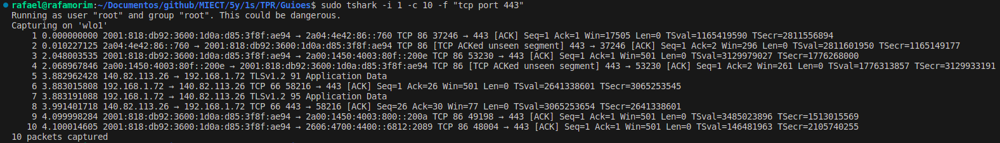
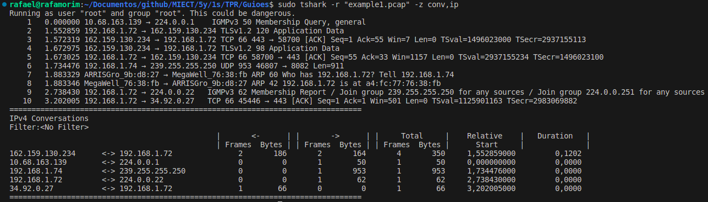

## To use tshark:

- 1º -> Open terminal in admin mode
- 2º -> To discover the device write **`tshark -D`** on linux, but in the windows firstable we should to go for wireshark path
- 3º -> Find "wlo1" and memorise the number associated to capture wifi device
- 4º -> And then type **`tshark -i 1 -c 15`**
------------------------------------------------------------
-i < interface > || -c < n packet count> stop after n packets (def: infinite) 

------------------------------------------------------------
- 5º -> Otherwise we can do a stop condition by duration(s)/filesize(KB)/files/packets typing **`tshark -i 1 -a duration:15`** or **`tshark -w "example2.pcap" -a filesize:1`**. In this example, the capture stops after 15 seconds

------------------------------------------------------------

- 6º -> Also exists the promiscuous mode allows the network interface to capture all network traffic on the network segment it is connected to, regardless of the destination of the packets. Normally, network interfaces only capture packets addressed to their own MAC (Media Access Control) address. To do that we type **`tshark -i 1 -a duration:15`**
- 7º -> If we need to save the capture in a file specifying the format with **-F** (to check all to file format execute **`tshark -F`**) we usually use the parameter -w. We can check with this expression: **`tshark -i 1 -w example1.pcap -F pcap -c 10`**
------------------------------------------------------------
Give the permissions to write:
**`sudo chmod a+rwx /home/rafael/Documentos/github/MIECT/5y/1s/TPR/Guioes`**

Go to the path and open with sudo:
**`sudo wireshark example1.pcap`**

------------------------------------------------------------

- 8º -> With **-f** we can filtered captures by tcp/udp/ports/...
For example: **`tshark -i 1 -c 10 -f "tcp port 443"`**

------------------------------------------------------------

To read a capture for a file we only need to write this: **`tshark -r "example1.pcap"`**

To convert caps into a table of ips, making more easier to read we do: **`tshark -r "example1.pcap" -z conv,ip`**, -z is used to analise statistics

------------------------------------------------------------